Wild Blueberry Yield Prediction
================
Trevor Okinda
2024

- [Student Details](#student-details)
- [Setup Chunk](#setup-chunk)
  - [Source:](#source)
  - [Reference:](#reference)
- [Exploratory Data Analysis](#exploratory-data-analysis)
  - [Load dataset](#load-dataset)
  - [Measures of Frequency](#measures-of-frequency)
  - [Measures of Central Tendency](#measures-of-central-tendency)
  - [Measures of Distribution](#measures-of-distribution)
  - [Measures of Relationship](#measures-of-relationship)
  - [Plots](#plots)
- [Preprocessing and Data
  Transformation](#preprocessing-and-data-transformation)
  - [Missing Values](#missing-values)
- [Training Model](#training-model)
  - [Data Splitting](#data-splitting)
  - [Bootstrapping](#bootstrapping)
  - [Cross-validation](#cross-validation)
  - [Model Training](#model-training)
  - [Performance Comparison](#performance-comparison)
  - [Saving Model](#saving-model)

# Student Details

|                       |                                 |
|-----------------------|---------------------------------|
| **Student ID Number** | 134780                          |
| **Student Name**      | Trevor Okinda                   |
| **BBIT 4.2 Group**    | C                               |
| **Project Name**      | Wild Blueberry Yield Prediction |

# Setup Chunk

**Note:** the following KnitR options have been set as the global
defaults: <BR>
`knitr::opts_chunk$set(echo = TRUE, warning = FALSE, eval = TRUE, collapse = FALSE, tidy = TRUE)`.

More KnitR options are documented here
<https://bookdown.org/yihui/rmarkdown-cookbook/chunk-options.html> and
here <https://yihui.org/knitr/options/>.

### Source:

The dataset that was used can be downloaded here: *\<<a
href="https://www.kaggle.com/datasets/shashwatwork/wild-blueberry-yield-prediction-dataset\"
class="uri">https://www.kaggle.com/datasets/shashwatwork/wild-blueberry-yield-prediction-dataset\</a>\>*

### Reference:

*\<Tiwari, S. (2020). Wild Blueberry Yield Prediction Dataset. Retrieved
from Kaggle Qu, H., Obsie, E., & Drummond, F. (2020). Data for: Wild
blueberry yield prediction using a combination of computer simulation
and machine learning algorithms. Mendeley Data, V1. <a
href="https://www.kaggle.com/datasets/shashwatwork/wild-blueberry-yield-prediction-dataset\"
class="uri">https://www.kaggle.com/datasets/shashwatwork/wild-blueberry-yield-prediction-dataset\</a>\>  
Refer to the APA 7th edition manual for rules on how to cite datasets:
<https://apastyle.apa.org/style-grammar-guidelines/references/examples/data-set-references>*

# Exploratory Data Analysis

## Load dataset

``` r
# Load dataset
wild_blueberry_data <- read.csv("WildBlueberryPollinationSimulationData.csv", colClasses = c(
  clonesize = "numeric",
  honeybee = "numeric",
  bumbles = "numeric",
  andrena = "numeric",
  osmia = "numeric",
  MaxOfUpperTRange = "numeric",
  MinOfUpperTRange = "numeric",
  AverageOfUpperTRange = "numeric",
  MaxOfLowerTRange = "numeric",
  MinOfLowerTRange = "numeric",
  AverageOfLowerTRange = "numeric",
  RainingDays = "numeric",
  AverageRainingDays = "numeric",
  fruitset = "numeric",
  fruitmass = "numeric",
  seeds = "numeric",
  yield = "numeric"
))

# Display the structure of the dataset
str(wild_blueberry_data)
```

    ## 'data.frame':    777 obs. of  17 variables:
    ##  $ clonesize           : num  37.5 37.5 37.5 37.5 37.5 37.5 37.5 37.5 37.5 37.5 ...
    ##  $ honeybee            : num  0.75 0.75 0.75 0.75 0.75 0.75 0.75 0.75 0.75 0.75 ...
    ##  $ bumbles             : num  0.25 0.25 0.25 0.25 0.25 0.25 0.25 0.25 0.25 0.25 ...
    ##  $ andrena             : num  0.25 0.25 0.25 0.25 0.25 0.25 0.25 0.25 0.25 0.25 ...
    ##  $ osmia               : num  0.25 0.25 0.25 0.25 0.25 0.25 0.25 0.25 0.25 0.25 ...
    ##  $ MaxOfUpperTRange    : num  86 86 94.6 94.6 86 86 94.6 94.6 77.4 77.4 ...
    ##  $ MinOfUpperTRange    : num  52 52 57.2 57.2 52 52 57.2 57.2 46.8 46.8 ...
    ##  $ AverageOfUpperTRange: num  71.9 71.9 79 79 71.9 71.9 79 79 64.7 64.7 ...
    ##  $ MaxOfLowerTRange    : num  62 62 68.2 68.2 62 62 68.2 68.2 55.8 55.8 ...
    ##  $ MinOfLowerTRange    : num  30 30 33 33 30 30 33 33 27 27 ...
    ##  $ AverageOfLowerTRange: num  50.8 50.8 55.9 55.9 50.8 50.8 55.9 55.9 45.8 45.8 ...
    ##  $ RainingDays         : num  16 1 16 1 24 34 24 34 16 1 ...
    ##  $ AverageRainingDays  : num  0.26 0.1 0.26 0.1 0.39 0.56 0.39 0.56 0.26 0.1 ...
    ##  $ fruitset            : num  0.411 0.444 0.384 0.408 0.354 ...
    ##  $ fruitmass           : num  0.408 0.425 0.399 0.409 0.383 ...
    ##  $ seeds               : num  31.7 33.4 30.5 31.6 28.9 ...
    ##  $ yield               : num  3813 4948 3867 4304 3436 ...

``` r
# View the first few rows of the dataset
head(wild_blueberry_data)
```

    ##   clonesize honeybee bumbles andrena osmia MaxOfUpperTRange MinOfUpperTRange
    ## 1      37.5     0.75    0.25    0.25  0.25             86.0             52.0
    ## 2      37.5     0.75    0.25    0.25  0.25             86.0             52.0
    ## 3      37.5     0.75    0.25    0.25  0.25             94.6             57.2
    ## 4      37.5     0.75    0.25    0.25  0.25             94.6             57.2
    ## 5      37.5     0.75    0.25    0.25  0.25             86.0             52.0
    ## 6      37.5     0.75    0.25    0.25  0.25             86.0             52.0
    ##   AverageOfUpperTRange MaxOfLowerTRange MinOfLowerTRange AverageOfLowerTRange
    ## 1                 71.9             62.0               30                 50.8
    ## 2                 71.9             62.0               30                 50.8
    ## 3                 79.0             68.2               33                 55.9
    ## 4                 79.0             68.2               33                 55.9
    ## 5                 71.9             62.0               30                 50.8
    ## 6                 71.9             62.0               30                 50.8
    ##   RainingDays AverageRainingDays  fruitset fruitmass    seeds    yield
    ## 1          16               0.26 0.4106521 0.4081590 31.67890 3813.166
    ## 2           1               0.10 0.4442544 0.4254576 33.44938 4947.606
    ## 3          16               0.26 0.3837865 0.3991724 30.54631 3866.799
    ## 4           1               0.10 0.4075642 0.4087893 31.56259 4303.943
    ## 5          24               0.39 0.3544130 0.3827029 28.87371 3436.494
    ## 6          34               0.56 0.3096695 0.3662835 27.34545 2825.004

``` r
# View the dataset in a separate viewer window
View(wild_blueberry_data)
```

## Measures of Frequency

``` r
# Measures of frequency

# Count of unique values in each column
unique_counts <- sapply(wild_blueberry_data, function(x) length(unique(x)))

# Summary of unique value counts
summary_unique <- summary(unique_counts)

# Frequency table for categorical variables
frequency_table <- lapply(wild_blueberry_data[, sapply(wild_blueberry_data, is.factor)], table)

# Display results
print("Summary of Unique Value Counts:")
```

    ## [1] "Summary of Unique Value Counts:"

``` r
print(summary_unique)
```

    ##    Min. 1st Qu.  Median    Mean 3rd Qu.    Max. 
    ##     5.0     5.0     6.0   187.9    12.0   777.0

``` r
print("Frequency Tables for Categorical Variables:")
```

    ## [1] "Frequency Tables for Categorical Variables:"

``` r
print(frequency_table)
```

    ## named list()

## Measures of Central Tendency

``` r
# Measures of central tendency

# Calculate mean, median, and mode for numeric variables
central_tendency <- data.frame(
  Mean = sapply(wild_blueberry_data[, sapply(wild_blueberry_data, is.numeric)], mean, na.rm = TRUE),
  Median = sapply(wild_blueberry_data[, sapply(wild_blueberry_data, is.numeric)], median, na.rm = TRUE)
)

# Mode function
get_mode <- function(x) {
  ux <- unique(x)
  ux[which.max(tabulate(match(x, ux)))]
}

# Calculate mode
mode_values <- sapply(wild_blueberry_data[, sapply(wild_blueberry_data, is.numeric)], get_mode)

# Combine mean, median, and mode into one dataframe
central_tendency <- cbind(central_tendency, Mode = mode_values)

# Display results
print("Measures of Central Tendency:")
```

    ## [1] "Measures of Central Tendency:"

``` r
print(central_tendency)
```

    ##                              Mean       Median         Mode
    ## clonesize              18.7676963   12.5000000   12.5000000
    ## honeybee                0.4171326    0.2500000    0.2500000
    ## bumbles                 0.2823887    0.2500000    0.2500000
    ## andrena                 0.4688172    0.5000000    0.3800000
    ## osmia                   0.5620618    0.6300000    0.5000000
    ## MaxOfUpperTRange       82.2770914   86.0000000   86.0000000
    ## MinOfUpperTRange       49.7005148   52.0000000   52.0000000
    ## AverageOfUpperTRange   68.7230373   71.9000000   71.9000000
    ## MaxOfLowerTRange       59.3093951   62.0000000   62.0000000
    ## MinOfLowerTRange       28.6902188   30.0000000   30.0000000
    ## AverageOfLowerTRange   48.6131274   50.8000000   50.8000000
    ## RainingDays            18.3092921   16.0000000   16.0000000
    ## AverageRainingDays      0.3200000    0.2600000    0.2600000
    ## fruitset                0.5021206    0.5082965    0.4106521
    ## fruitmass               0.4459834    0.4455875    0.4081590
    ## seeds                  36.1224316   36.1660435   31.6788984
    ## yield                6012.8491647 6107.3824660 3813.1657950

## Measures of Distribution

``` r
# Measures of distribution

# Calculate range, variance, and standard deviation for numeric variables
distribution <- data.frame(
  Range = sapply(wild_blueberry_data[, sapply(wild_blueberry_data, is.numeric)], function(x) max(x, na.rm = TRUE) - min(x, na.rm = TRUE)),
  Variance = sapply(wild_blueberry_data[, sapply(wild_blueberry_data, is.numeric)], var, na.rm = TRUE),
  StdDev = sapply(wild_blueberry_data[, sapply(wild_blueberry_data, is.numeric)], sd, na.rm = TRUE)
)

# Display results
print("Measures of Distribution:")
```

    ## [1] "Measures of Distribution:"

``` r
print(distribution)
```

    ##                             Range     Variance       StdDev
    ## clonesize              30.0000000 4.898688e+01 6.999063e+00
    ## honeybee               18.4300000 9.582526e-01 9.789038e-01
    ## bumbles                 0.5850000 4.401449e-03 6.634342e-02
    ## andrena                 0.7500000 2.593777e-02 1.610521e-01
    ## osmia                   0.7500000 2.860136e-02 1.691194e-01
    ## MaxOfUpperTRange       24.9000000 8.452494e+01 9.193745e+00
    ## MinOfUpperTRange       18.2000000 3.131263e+01 5.595769e+00
    ## AverageOfUpperTRange   20.8000000 5.893608e+01 7.676984e+00
    ## MaxOfLowerTRange       18.0000000 4.419271e+01 6.647760e+00
    ## MinOfLowerTRange        8.7000000 1.030119e+01 3.209547e+00
    ## AverageOfLowerTRange   14.7000000 2.934467e+01 5.417072e+00
    ## RainingDays            33.0000000 1.469969e+02 1.212423e+01
    ## AverageRainingDays      0.5000000 2.933660e-02 1.712793e-01
    ## fruitset                0.4594124 6.311522e-03 7.944509e-02
    ## fruitmass               0.2237395 1.626724e-03 4.033267e-02
    ## seeds                  24.5059061 1.916591e+01 4.377889e+00
    ## yield                7331.6978200 1.841328e+06 1.356955e+03

## Measures of Relationship

``` r
# Measures of relationship

# Calculate correlation coefficients for numeric variables
correlation_matrix <- cor(wild_blueberry_data[, sapply(wild_blueberry_data, is.numeric)], use = "pairwise.complete.obs")

# Create contingency tables for categorical variables
contingency_tables <- lapply(wild_blueberry_data[, sapply(wild_blueberry_data, is.factor)], table)

# Display results
print("Correlation Matrix for Numeric Variables:")
```

    ## [1] "Correlation Matrix for Numeric Variables:"

``` r
print(correlation_matrix)
```

    ##                         clonesize     honeybee      bumbles      andrena
    ## clonesize             1.000000000  0.119745370  0.004807148 -0.008451283
    ## honeybee              0.119745370  1.000000000 -0.233953659 -0.125913373
    ## bumbles               0.004807148 -0.233953659  1.000000000  0.010757845
    ## andrena              -0.008451283 -0.125913373  0.010757845  1.000000000
    ## osmia                -0.139048672 -0.189058242  0.293664683  0.387378808
    ## MaxOfUpperTRange      0.034156568  0.026358910 -0.022862657 -0.026497234
    ## MinOfUpperTRange      0.032853649  0.025467214 -0.005800929 -0.023887163
    ## AverageOfUpperTRange  0.033751804  0.026364787 -0.015820543 -0.025578443
    ## MaxOfLowerTRange      0.034294932  0.026476782 -0.024661517 -0.026774572
    ## MinOfLowerTRange      0.033767611  0.026103806 -0.016800544 -0.025622628
    ## AverageOfLowerTRange  0.033566141  0.025646535 -0.013984879 -0.025114592
    ## RainingDays          -0.021695570 -0.073818199  0.058062549  0.035297426
    ## AverageRainingDays   -0.024455408 -0.093477165  0.075376349  0.043739401
    ## fruitset             -0.556591260 -0.009406265  0.289889843  0.102548931
    ## fruitmass            -0.474038493 -0.166418917  0.358201987  0.092469591
    ## seeds                -0.496156016 -0.170807927  0.380206466  0.089177695
    ## yield                -0.516736655 -0.044249751  0.309407117  0.140277277
    ##                            osmia MaxOfUpperTRange MinOfUpperTRange
    ## clonesize            -0.13904867      0.034156568     0.0328536491
    ## honeybee             -0.18905824      0.026358910     0.0254672142
    ## bumbles               0.29366468     -0.022862657    -0.0058009286
    ## andrena               0.38737881     -0.026497234    -0.0238871629
    ## osmia                 1.00000000     -0.063754935    -0.0432373766
    ## MaxOfUpperTRange     -0.06375493      1.000000000     0.9909609001
    ## MinOfUpperTRange     -0.04323738      0.990960900     1.0000000000
    ## AverageOfUpperTRange -0.05544141      0.998313933     0.9970559315
    ## MaxOfLowerTRange     -0.06590979      0.999899881     0.9889879700
    ## MinOfLowerTRange     -0.05654596      0.998842121     0.9962670297
    ## AverageOfLowerTRange -0.05314061      0.997657961     0.9977975087
    ## RainingDays           0.08366651     -0.003285616    -0.0007977194
    ## AverageRainingDays    0.10418844     -0.005676919    -0.0018890783
    ## fruitset              0.33417776     -0.130450229    -0.1198557705
    ## fruitmass             0.33613618      0.058492280     0.0676707157
    ## seeds                 0.35311570     -0.034485955    -0.0242403187
    ## yield                 0.38089178     -0.187075385    -0.1758832443
    ##                      AverageOfUpperTRange MaxOfLowerTRange MinOfLowerTRange
    ## clonesize                     0.033751804      0.034294932      0.033767611
    ## honeybee                      0.026364787      0.026476782      0.026103806
    ## bumbles                      -0.015820543     -0.024661517     -0.016800544
    ## andrena                      -0.025578443     -0.026774572     -0.025622628
    ## osmia                        -0.055441415     -0.065909793     -0.056545957
    ## MaxOfUpperTRange              0.998313933      0.999899881      0.998842121
    ## MinOfUpperTRange              0.997055931      0.988987970      0.996267030
    ## AverageOfUpperTRange          1.000000000      0.997412860      0.999944220
    ## MaxOfLowerTRange              0.997412860      1.000000000      0.998071158
    ## MinOfLowerTRange              0.999944220      0.998071158      1.000000000
    ## AverageOfLowerTRange          0.999923355      0.996609098      0.999787492
    ## RainingDays                  -0.002325456     -0.003557673     -0.002403355
    ## AverageRainingDays           -0.004194561     -0.006086658     -0.004334376
    ## fruitset                     -0.125081634     -0.130693300     -0.126788472
    ## fruitmass                     0.064034304      0.058486915      0.062093182
    ## seeds                        -0.028924825     -0.034674088     -0.030727342
    ## yield                        -0.181773909     -0.187439441     -0.183339125
    ##                      AverageOfLowerTRange   RainingDays AverageRainingDays
    ## clonesize                     0.033566141 -0.0216955696       -0.024455408
    ## honeybee                      0.025646535 -0.0738181989       -0.093477165
    ## bumbles                      -0.013984879  0.0580625488        0.075376349
    ## andrena                      -0.025114592  0.0352974257        0.043739401
    ## osmia                        -0.053140607  0.0836665060        0.104188441
    ## MaxOfUpperTRange              0.997657961 -0.0032856161       -0.005676919
    ## MinOfUpperTRange              0.997797509 -0.0007977194       -0.001889078
    ## AverageOfUpperTRange          0.999923355 -0.0023254559       -0.004194561
    ## MaxOfLowerTRange              0.996609098 -0.0035576725       -0.006086658
    ## MinOfLowerTRange              0.999787492 -0.0024033546       -0.004334376
    ## AverageOfLowerTRange          1.000000000 -0.0019245344       -0.003626399
    ## RainingDays                  -0.001924534  1.0000000000        0.991394645
    ## AverageRainingDays           -0.003626399  0.9913946453        1.000000000
    ## fruitset                     -0.124784315 -0.4842289240       -0.488809221
    ## fruitmass                     0.064180953 -0.4523277088       -0.451836736
    ## seeds                        -0.028620812 -0.4754616348       -0.474528133
    ## yield                        -0.181292949 -0.5400685357       -0.541214929
    ##                          fruitset   fruitmass       seeds       yield
    ## clonesize            -0.556591260 -0.47403849 -0.49615602 -0.51673666
    ## honeybee             -0.009406265 -0.16641892 -0.17080793 -0.04424975
    ## bumbles               0.289889843  0.35820199  0.38020647  0.30940712
    ## andrena               0.102548931  0.09246959  0.08917770  0.14027728
    ## osmia                 0.334177762  0.33613618  0.35311570  0.38089178
    ## MaxOfUpperTRange     -0.130450229  0.05849228 -0.03448596 -0.18707538
    ## MinOfUpperTRange     -0.119855770  0.06767072 -0.02424032 -0.17588324
    ## AverageOfUpperTRange -0.125081634  0.06403430 -0.02892482 -0.18177391
    ## MaxOfLowerTRange     -0.130693300  0.05848691 -0.03467409 -0.18743944
    ## MinOfLowerTRange     -0.126788472  0.06209318 -0.03072734 -0.18333912
    ## AverageOfLowerTRange -0.124784315  0.06418095 -0.02862081 -0.18129295
    ## RainingDays          -0.484228924 -0.45232771 -0.47546163 -0.54006854
    ## AverageRainingDays   -0.488809221 -0.45183674 -0.47452813 -0.54121493
    ## fruitset              1.000000000  0.94819314  0.96669390  0.98408117
    ## fruitmass             0.948193145  1.00000000  0.99126981  0.93036495
    ## seeds                 0.966693899  0.99126981  1.00000000  0.96124874
    ## yield                 0.984081173  0.93036495  0.96124874  1.00000000

``` r
print("Contingency Tables for Categorical Variables:")
```

    ## [1] "Contingency Tables for Categorical Variables:"

``` r
print(contingency_tables)
```

    ## named list()

## Plots

``` r
# Load the ggplot2 library
library(ggplot2)

# Univariate plots (histograms for numeric variables, bar plots for categorical variables)
univariate_plots <- lapply(names(wild_blueberry_data), function(var_name) {
  if (is.numeric(wild_blueberry_data[[var_name]])) {
    ggplot(wild_blueberry_data, aes_string(x = var_name)) +
      geom_histogram(fill = "skyblue", color = "black") +
      labs(title = paste("Histogram of", var_name), x = var_name, y = "Frequency")
  } else {
    ggplot(wild_blueberry_data, aes_string(x = var_name)) +
      geom_bar(fill = "skyblue", color = "black") +
      labs(title = paste("Bar Plot of", var_name), x = var_name, y = "Frequency")
  }
})


# Display plots
print("Univariate Plots:")
```

    ## [1] "Univariate Plots:"

``` r
print(univariate_plots)
```

    ## [[1]]

    ## `stat_bin()` using `bins = 30`. Pick better value with `binwidth`.

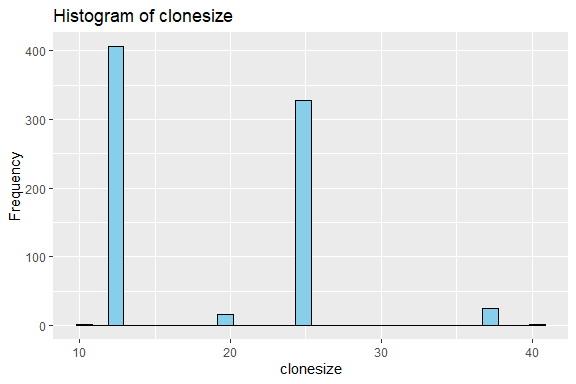<!-- -->

    ## 
    ## [[2]]

    ## `stat_bin()` using `bins = 30`. Pick better value with `binwidth`.

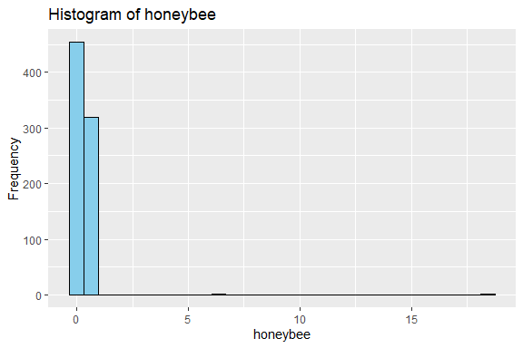<!-- -->

    ## 
    ## [[3]]

    ## `stat_bin()` using `bins = 30`. Pick better value with `binwidth`.

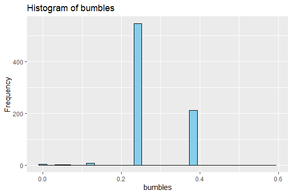<!-- -->

    ## 
    ## [[4]]

    ## `stat_bin()` using `bins = 30`. Pick better value with `binwidth`.

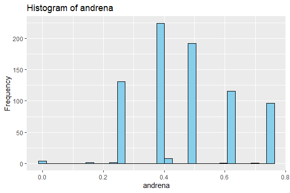<!-- -->

    ## 
    ## [[5]]

    ## `stat_bin()` using `bins = 30`. Pick better value with `binwidth`.

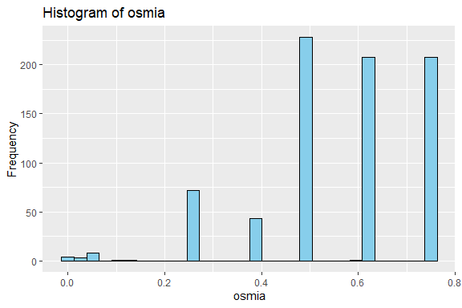<!-- -->

    ## 
    ## [[6]]

    ## `stat_bin()` using `bins = 30`. Pick better value with `binwidth`.

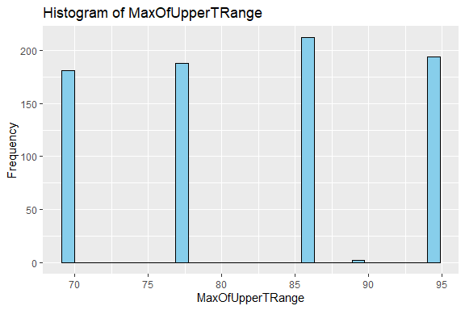<!-- -->

    ## 
    ## [[7]]

    ## `stat_bin()` using `bins = 30`. Pick better value with `binwidth`.

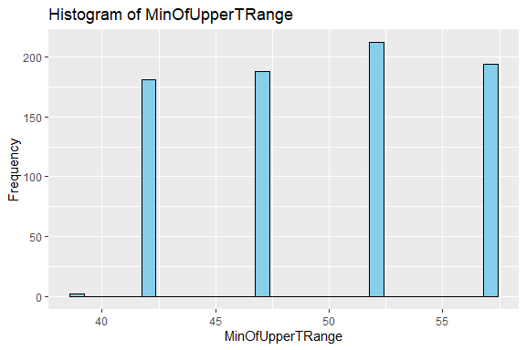<!-- -->

    ## 
    ## [[8]]

    ## `stat_bin()` using `bins = 30`. Pick better value with `binwidth`.

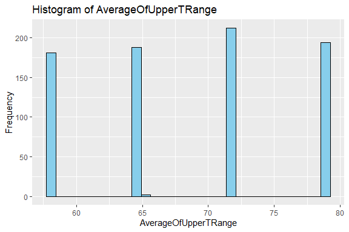<!-- -->

    ## 
    ## [[9]]

    ## `stat_bin()` using `bins = 30`. Pick better value with `binwidth`.

<!-- -->

    ## 
    ## [[10]]

    ## `stat_bin()` using `bins = 30`. Pick better value with `binwidth`.

<!-- -->

    ## 
    ## [[11]]

    ## `stat_bin()` using `bins = 30`. Pick better value with `binwidth`.

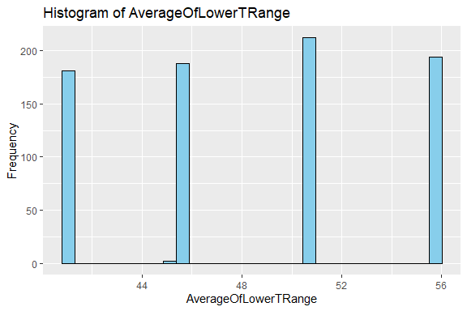<!-- -->

    ## 
    ## [[12]]

    ## `stat_bin()` using `bins = 30`. Pick better value with `binwidth`.

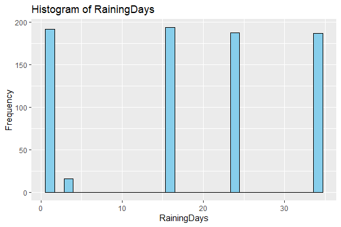<!-- -->

    ## 
    ## [[13]]

    ## `stat_bin()` using `bins = 30`. Pick better value with `binwidth`.

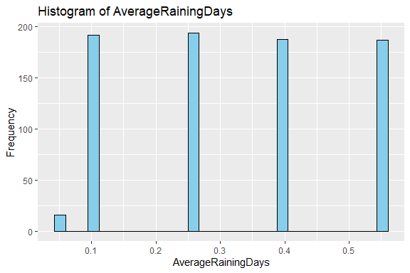<!-- -->

    ## 
    ## [[14]]

    ## `stat_bin()` using `bins = 30`. Pick better value with `binwidth`.

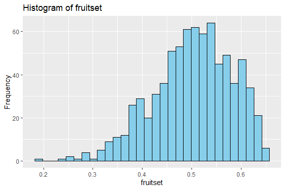<!-- -->

    ## 
    ## [[15]]

    ## `stat_bin()` using `bins = 30`. Pick better value with `binwidth`.

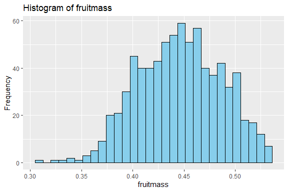<!-- -->

    ## 
    ## [[16]]

    ## `stat_bin()` using `bins = 30`. Pick better value with `binwidth`.

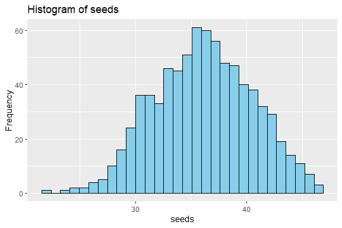<!-- -->

    ## 
    ## [[17]]

    ## `stat_bin()` using `bins = 30`. Pick better value with `binwidth`.

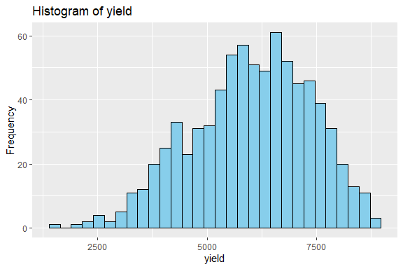<!-- -->

# Preprocessing and Data Transformation

## Missing Values

``` r
# Check for missing values
missing_values <- sum(is.na(wild_blueberry_data))

# Display summary of missing values
print(paste("Number of missing values:", missing_values))
```

    ## [1] "Number of missing values: 0"

``` r
# Summary of missing values by column
print(summary(is.na(wild_blueberry_data)))
```

    ##  clonesize        honeybee        bumbles         andrena       
    ##  Mode :logical   Mode :logical   Mode :logical   Mode :logical  
    ##  FALSE:777       FALSE:777       FALSE:777       FALSE:777      
    ##    osmia         MaxOfUpperTRange MinOfUpperTRange AverageOfUpperTRange
    ##  Mode :logical   Mode :logical    Mode :logical    Mode :logical       
    ##  FALSE:777       FALSE:777        FALSE:777        FALSE:777           
    ##  MaxOfLowerTRange MinOfLowerTRange AverageOfLowerTRange RainingDays    
    ##  Mode :logical    Mode :logical    Mode :logical        Mode :logical  
    ##  FALSE:777        FALSE:777        FALSE:777            FALSE:777      
    ##  AverageRainingDays  fruitset       fruitmass         seeds        
    ##  Mode :logical      Mode :logical   Mode :logical   Mode :logical  
    ##  FALSE:777          FALSE:777       FALSE:777       FALSE:777      
    ##    yield        
    ##  Mode :logical  
    ##  FALSE:777

# Training Model

## Data Splitting

``` r
# Load the caret library for data splitting
library(caret)
```

    ## Loading required package: lattice

``` r
# Set seed for reproducibility
set.seed(123)

# Define the proportion of data to be used for training (e.g., 70% for training, 30% for testing)
train_proportion <- 0.7

# Split the dataset into training and testing sets
index <- createDataPartition(y = wild_blueberry_data$yield, p = train_proportion, list = FALSE)
train_data <- wild_blueberry_data[index, ]
test_data <- wild_blueberry_data[-index, ]

# Print the dimensions of the training and testing sets
print("Dimensions of Training Data:")
```

    ## [1] "Dimensions of Training Data:"

``` r
print(dim(train_data))
```

    ## [1] 545  17

``` r
print("Dimensions of Testing Data:")
```

    ## [1] "Dimensions of Testing Data:"

``` r
print(dim(test_data))
```

    ## [1] 232  17

## Bootstrapping

``` r
# Load required package
library(boot)
```

    ## 
    ## Attaching package: 'boot'

    ## The following object is masked from 'package:lattice':
    ## 
    ##     melanoma

``` r
# Define the number of bootstrap iterations
num_iterations <- 1000

# Create an empty vector to store the bootstrapped means
bootstrapped_means <- numeric(num_iterations)

# Perform bootstrapping
for (i in 1:num_iterations) {
  # Sample with replacement from the original dataset
  boot_sample <- sample(wild_blueberry_data$yield, replace = TRUE)
  # Calculate the mean of the bootstrapped sample and store it
  bootstrapped_means[i] <- mean(boot_sample)
}

# Calculate the mean and standard error of bootstrapped means
mean_boot_mean <- mean(bootstrapped_means)
se_boot_mean <- sd(bootstrapped_means)

# Display results
print("Bootstrapping Results:")
```

    ## [1] "Bootstrapping Results:"

``` r
print(paste("Mean of Bootstrapped Means:", mean_boot_mean))
```

    ## [1] "Mean of Bootstrapped Means: 6013.77859564375"

``` r
print(paste("Standard Error of Bootstrapped Means:", se_boot_mean))
```

    ## [1] "Standard Error of Bootstrapped Means: 48.8041867630755"

## Cross-validation

``` r
# Load the caret library for cross-validation
library(caret)

# Define the number of folds for cross-validation
num_folds <- 10

# Define the control parameters for cross-validation
ctrl <- trainControl(method = "cv", number = num_folds)

# Define the model training process
model <- train(yield ~ ., data = wild_blueberry_data, method = "lm", trControl = ctrl)

# Print the cross-validated performance metrics
print("Cross-Validated Performance Metrics:")
```

    ## [1] "Cross-Validated Performance Metrics:"

``` r
print(model$results)
```

    ##   intercept     RMSE  Rsquared      MAE   RMSESD  RsquaredSD    MAESD
    ## 1      TRUE 126.1139 0.9915311 95.43129 12.62151 0.002110775 8.571854

## Model Training

``` r
# Load the caret library for model training
library(caret)

# Train linear regression model
lm_model <- train(yield ~ ., data = wild_blueberry_data, method = "lm")

# Train generalized linear model
glm_model <- train(yield ~ ., data = wild_blueberry_data, method = "glm")

# Train gradient boosting machine model
gbm_model <- train(yield ~ ., data = wild_blueberry_data, method = "gbm")
```

    ## Iter   TrainDeviance   ValidDeviance   StepSize   Improve
    ##      1  1731757.8657             nan     0.1000 244324.2007
    ##      2  1521119.2332             nan     0.1000 202512.2566
    ##      3  1344302.9691             nan     0.1000 174322.7390
    ##      4  1203965.2432             nan     0.1000 147668.0381
    ##      5  1073721.8020             nan     0.1000 133452.3423
    ##      6   961963.7422             nan     0.1000 96381.6224
    ##      7   856766.0952             nan     0.1000 104971.9001
    ##      8   773648.3851             nan     0.1000 81744.5689
    ##      9   699039.8030             nan     0.1000 78613.2567
    ##     10   629448.7799             nan     0.1000 71884.0787
    ##     20   262825.4718             nan     0.1000 17976.1548
    ##     40    77016.9327             nan     0.1000 3097.5567
    ##     60    39440.1037             nan     0.1000  990.8891
    ##     80    26384.4339             nan     0.1000  268.0040
    ##    100    20642.6476             nan     0.1000  171.4976
    ##    120    17919.0025             nan     0.1000   92.9401
    ##    140    16533.6330             nan     0.1000   26.6266
    ##    150    16113.7878             nan     0.1000  -18.7049
    ## 
    ## Iter   TrainDeviance   ValidDeviance   StepSize   Improve
    ##      1  1670534.8034             nan     0.1000 291132.0068
    ##      2  1424383.9370             nan     0.1000 268372.1895
    ##      3  1208279.3511             nan     0.1000 224597.5771
    ##      4  1021824.9240             nan     0.1000 190244.0734
    ##      5   865447.9642             nan     0.1000 160639.6033
    ##      6   740714.9076             nan     0.1000 122605.2511
    ##      7   642802.0536             nan     0.1000 100866.1747
    ##      8   554102.2707             nan     0.1000 87521.0020
    ##      9   473417.9217             nan     0.1000 81668.7542
    ##     10   416181.6780             nan     0.1000 51646.3379
    ##     20   125043.1622             nan     0.1000 12049.1669
    ##     40    33711.0221             nan     0.1000 1325.6953
    ##     60    18930.3135             nan     0.1000  252.8454
    ##     80    15296.8623             nan     0.1000   47.6350
    ##    100    13755.5602             nan     0.1000   -9.9737
    ##    120    12623.0794             nan     0.1000   -2.3026
    ##    140    11776.8172             nan     0.1000  -35.9607
    ##    150    11465.8471             nan     0.1000  -27.4837
    ## 
    ## Iter   TrainDeviance   ValidDeviance   StepSize   Improve
    ##      1  1633721.7671             nan     0.1000 333431.3599
    ##      2  1358536.8681             nan     0.1000 268731.8121
    ##      3  1134320.5381             nan     0.1000 222207.6269
    ##      4   950513.5969             nan     0.1000 172507.3889
    ##      5   798690.1439             nan     0.1000 150428.9895
    ##      6   667970.1184             nan     0.1000 125513.5349
    ##      7   562179.8605             nan     0.1000 105862.3412
    ##      8   475670.0110             nan     0.1000 89242.8119
    ##      9   401335.2152             nan     0.1000 68265.4813
    ##     10   341387.5640             nan     0.1000 61148.4689
    ##     20    90763.6259             nan     0.1000 7738.3845
    ##     40    22760.6506             nan     0.1000  605.7678
    ##     60    14311.0470             nan     0.1000   33.3182
    ##     80    12139.9695             nan     0.1000   -4.4411
    ##    100    10757.8698             nan     0.1000  -21.0872
    ##    120     9930.2155             nan     0.1000  -78.2722
    ##    140     9283.6380             nan     0.1000  -29.8662
    ##    150     8968.0260             nan     0.1000   -8.9744
    ## 
    ## Iter   TrainDeviance   ValidDeviance   StepSize   Improve
    ##      1  1571319.3377             nan     0.1000 216917.8895
    ##      2  1388095.7217             nan     0.1000 155627.3832
    ##      3  1231016.4376             nan     0.1000 162834.8505
    ##      4  1098243.6007             nan     0.1000 131022.5251
    ##      5   981863.1280             nan     0.1000 120511.7384
    ##      6   880443.2041             nan     0.1000 98293.8288
    ##      7   792266.3044             nan     0.1000 85629.2141
    ##      8   718478.2188             nan     0.1000 71295.5014
    ##      9   646030.5639             nan     0.1000 67929.8055
    ##     10   590419.9600             nan     0.1000 60066.5672
    ##     20   251154.7730             nan     0.1000 17600.1585
    ##     40    81918.4095             nan     0.1000 2414.3635
    ##     60    43767.4675             nan     0.1000  906.1376
    ##     80    29324.8045             nan     0.1000  429.1367
    ##    100    23145.2749             nan     0.1000   68.3080
    ##    120    20382.7032             nan     0.1000    7.6361
    ##    140    19148.1093             nan     0.1000   -8.7663
    ##    150    18803.0300             nan     0.1000 -104.6834
    ## 
    ## Iter   TrainDeviance   ValidDeviance   StepSize   Improve
    ##      1  1515320.2127             nan     0.1000 249203.3702
    ##      2  1297697.4868             nan     0.1000 208532.5615
    ##      3  1087048.9422             nan     0.1000 199490.3118
    ##      4   926988.3468             nan     0.1000 155973.1721
    ##      5   791135.8658             nan     0.1000 129901.6291
    ##      6   686237.6191             nan     0.1000 105753.9602
    ##      7   589048.1713             nan     0.1000 91443.8975
    ##      8   510566.6597             nan     0.1000 77789.2132
    ##      9   445344.6226             nan     0.1000 60030.2637
    ##     10   385973.5666             nan     0.1000 55595.8664
    ##     20   118764.7547             nan     0.1000 11760.9887
    ##     40    34306.6580             nan     0.1000  959.3708
    ##     60    20526.3462             nan     0.1000   88.1469
    ##     80    17236.8434             nan     0.1000  -45.0629
    ##    100    15716.9983             nan     0.1000   31.7372
    ##    120    14834.1301             nan     0.1000  -52.7259
    ##    140    13981.7096             nan     0.1000  -73.8471
    ##    150    13622.3749             nan     0.1000  -19.9877
    ## 
    ## Iter   TrainDeviance   ValidDeviance   StepSize   Improve
    ##      1  1482578.1310             nan     0.1000 318286.9650
    ##      2  1231636.5182             nan     0.1000 264841.2148
    ##      3  1029009.3612             nan     0.1000 211238.1517
    ##      4   860452.9936             nan     0.1000 178725.3132
    ##      5   725768.0473             nan     0.1000 136934.5451
    ##      6   613392.2319             nan     0.1000 111281.6635
    ##      7   519700.6861             nan     0.1000 92646.8628
    ##      8   437314.2242             nan     0.1000 82430.2136
    ##      9   372841.4180             nan     0.1000 66137.2354
    ##     10   317483.1841             nan     0.1000 54143.7981
    ##     20    88938.9526             nan     0.1000 8896.1393
    ##     40    23576.4749             nan     0.1000  730.8660
    ##     60    15518.5709             nan     0.1000   68.4315
    ##     80    13044.3301             nan     0.1000   36.7340
    ##    100    11823.9240             nan     0.1000   -2.4607
    ##    120    10899.0784             nan     0.1000  -51.8720
    ##    140    10224.3250             nan     0.1000  -25.4914
    ##    150     9990.1867             nan     0.1000  -47.8936
    ## 
    ## Iter   TrainDeviance   ValidDeviance   StepSize   Improve
    ##      1  1514855.6213             nan     0.1000 211632.9950
    ##      2  1330825.4250             nan     0.1000 174761.1056
    ##      3  1173836.8550             nan     0.1000 145644.8766
    ##      4  1046100.8445             nan     0.1000 133399.2030
    ##      5   936406.3130             nan     0.1000 105969.4888
    ##      6   837546.1663             nan     0.1000 95905.2487
    ##      7   757414.3508             nan     0.1000 80693.2436
    ##      8   685821.2985             nan     0.1000 67095.9158
    ##      9   619060.6921             nan     0.1000 65023.0111
    ##     10   563097.6182             nan     0.1000 53155.4869
    ##     20   247680.4106             nan     0.1000 13338.3418
    ##     40    84122.1861             nan     0.1000 3266.6194
    ##     60    44288.3206             nan     0.1000 1163.1810
    ##     80    27867.0086             nan     0.1000  415.7206
    ##    100    21031.8192             nan     0.1000  224.4607
    ##    120    18077.7409             nan     0.1000   52.7477
    ##    140    16707.7943             nan     0.1000  -23.0375
    ##    150    16247.7304             nan     0.1000  -26.2266
    ## 
    ## Iter   TrainDeviance   ValidDeviance   StepSize   Improve
    ##      1  1462679.6484             nan     0.1000 275893.9449
    ##      2  1248907.5695             nan     0.1000 212658.9875
    ##      3  1057674.0433             nan     0.1000 191355.1952
    ##      4   911526.9423             nan     0.1000 145742.9332
    ##      5   782862.4301             nan     0.1000 120796.3768
    ##      6   673093.0135             nan     0.1000 110932.3014
    ##      7   576275.1470             nan     0.1000 87890.7120
    ##      8   499520.6236             nan     0.1000 79160.3999
    ##      9   437880.5913             nan     0.1000 59972.1343
    ##     10   387209.5880             nan     0.1000 53665.4954
    ##     20   128261.0949             nan     0.1000 11695.6897
    ##     40    34454.5532             nan     0.1000 2097.1454
    ##     60    19115.2551             nan     0.1000  165.4155
    ##     80    15435.1037             nan     0.1000  -14.6188
    ##    100    13709.4980             nan     0.1000    2.8242
    ##    120    12718.3667             nan     0.1000  -69.4115
    ##    140    12087.0071             nan     0.1000  -56.6235
    ##    150    11817.2616             nan     0.1000  -18.6650
    ## 
    ## Iter   TrainDeviance   ValidDeviance   StepSize   Improve
    ##      1  1439142.7103             nan     0.1000 273703.7268
    ##      2  1205718.5147             nan     0.1000 233378.1572
    ##      3  1011413.5838             nan     0.1000 194702.2209
    ##      4   853040.1332             nan     0.1000 157681.1145
    ##      5   719014.0388             nan     0.1000 136482.7468
    ##      6   606800.8504             nan     0.1000 115504.8533
    ##      7   512651.1846             nan     0.1000 87792.9374
    ##      8   436797.4989             nan     0.1000 75631.4235
    ##      9   371225.3359             nan     0.1000 67465.0996
    ##     10   319342.4816             nan     0.1000 46779.9131
    ##     20    90912.5080             nan     0.1000 7733.1440
    ##     40    24208.0330             nan     0.1000  768.9921
    ##     60    16118.9668             nan     0.1000  116.6769
    ##     80    13675.9996             nan     0.1000   31.9616
    ##    100    11988.4572             nan     0.1000  -28.7711
    ##    120    11112.6991             nan     0.1000  -41.3783
    ##    140    10425.1769             nan     0.1000  -45.9113
    ##    150    10139.7768             nan     0.1000  -20.2008
    ## 
    ## Iter   TrainDeviance   ValidDeviance   StepSize   Improve
    ##      1  1592990.7647             nan     0.1000 223133.1067
    ##      2  1408434.4068             nan     0.1000 177872.5615
    ##      3  1247079.7104             nan     0.1000 158113.7703
    ##      4  1115047.7576             nan     0.1000 143197.8584
    ##      5   993876.0790             nan     0.1000 117362.1812
    ##      6   900425.8992             nan     0.1000 87892.5489
    ##      7   806402.7565             nan     0.1000 96217.7562
    ##      8   730166.8547             nan     0.1000 71985.7192
    ##      9   664303.0596             nan     0.1000 61548.9492
    ##     10   602665.7101             nan     0.1000 63320.6513
    ##     20   261137.2030             nan     0.1000 16950.6211
    ##     40    82478.2771             nan     0.1000 3810.7712
    ##     60    42403.4484             nan     0.1000  923.0582
    ##     80    27730.8227             nan     0.1000  315.5298
    ##    100    21474.5033             nan     0.1000   91.1756
    ##    120    18826.7215             nan     0.1000   33.5732
    ##    140    17515.7935             nan     0.1000   29.9489
    ##    150    17054.2755             nan     0.1000   12.1960
    ## 
    ## Iter   TrainDeviance   ValidDeviance   StepSize   Improve
    ##      1  1552752.4189             nan     0.1000 276450.7469
    ##      2  1312021.2989             nan     0.1000 245865.7972
    ##      3  1109986.1601             nan     0.1000 212628.2813
    ##      4   945730.0392             nan     0.1000 177375.4096
    ##      5   812091.6525             nan     0.1000 131604.5457
    ##      6   698958.6069             nan     0.1000 104134.4933
    ##      7   605179.2041             nan     0.1000 99459.5955
    ##      8   520295.0459             nan     0.1000 85027.1254
    ##      9   455087.8721             nan     0.1000 71774.1494
    ##     10   401688.4381             nan     0.1000 54896.4760
    ##     20   126932.8138             nan     0.1000 13380.4272
    ##     40    34035.0275             nan     0.1000 1254.4080
    ##     60    20228.1019             nan     0.1000  344.9524
    ##     80    16415.8773             nan     0.1000  118.1740
    ##    100    14552.6721             nan     0.1000    9.4464
    ##    120    13369.1569             nan     0.1000  -26.2558
    ##    140    12649.2583             nan     0.1000  -22.8224
    ##    150    12202.2943             nan     0.1000  -14.6262
    ## 
    ## Iter   TrainDeviance   ValidDeviance   StepSize   Improve
    ##      1  1516342.1565             nan     0.1000 294408.3875
    ##      2  1269396.5427             nan     0.1000 247489.8337
    ##      3  1055894.4321             nan     0.1000 211552.0444
    ##      4   888052.7966             nan     0.1000 167072.0192
    ##      5   746321.9442             nan     0.1000 140826.1014
    ##      6   631881.9007             nan     0.1000 110881.3929
    ##      7   534277.9114             nan     0.1000 102435.8104
    ##      8   456363.2356             nan     0.1000 83454.3821
    ##      9   390618.4167             nan     0.1000 67817.0209
    ##     10   333096.7495             nan     0.1000 58658.6479
    ##     20    93641.3447             nan     0.1000 9783.9106
    ##     40    24414.3772             nan     0.1000  673.8219
    ##     60    16159.9979             nan     0.1000   99.0507
    ##     80    13569.3541             nan     0.1000   45.0808
    ##    100    12134.9385             nan     0.1000   53.9715
    ##    120    11222.3727             nan     0.1000  -53.8746
    ##    140    10339.7674             nan     0.1000   -7.9341
    ##    150    10101.3547             nan     0.1000  -26.6494
    ## 
    ## Iter   TrainDeviance   ValidDeviance   StepSize   Improve
    ##      1  1705626.6018             nan     0.1000 243898.0196
    ##      2  1508930.0966             nan     0.1000 201006.5710
    ##      3  1328984.6906             nan     0.1000 186417.2927
    ##      4  1179349.6155             nan     0.1000 151603.2520
    ##      5  1049306.1000             nan     0.1000 132829.2516
    ##      6   940910.6192             nan     0.1000 110278.8242
    ##      7   844714.3216             nan     0.1000 92355.7492
    ##      8   757166.6562             nan     0.1000 85719.0087
    ##      9   688497.0536             nan     0.1000 66204.7862
    ##     10   620150.5982             nan     0.1000 67754.3335
    ##     20   264901.1300             nan     0.1000 21324.4303
    ##     40    82749.4706             nan     0.1000 3357.6634
    ##     60    42101.2649             nan     0.1000  876.6755
    ##     80    27104.5429             nan     0.1000  345.9810
    ##    100    21120.7138             nan     0.1000  178.9437
    ##    120    18442.2571             nan     0.1000   51.8934
    ##    140    17091.6509             nan     0.1000   -9.8613
    ##    150    16693.4539             nan     0.1000  -11.5697
    ## 
    ## Iter   TrainDeviance   ValidDeviance   StepSize   Improve
    ##      1  1645633.7921             nan     0.1000 284489.3754
    ##      2  1400874.4169             nan     0.1000 223845.5795
    ##      3  1188236.6818             nan     0.1000 216349.3127
    ##      4  1011765.1155             nan     0.1000 168453.4768
    ##      5   855847.9254             nan     0.1000 149040.0453
    ##      6   733340.4785             nan     0.1000 127084.8677
    ##      7   635456.4662             nan     0.1000 98565.0687
    ##      8   547745.4923             nan     0.1000 93164.9503
    ##      9   473612.5883             nan     0.1000 75114.5236
    ##     10   413365.8006             nan     0.1000 58982.6964
    ##     20   126877.7657             nan     0.1000 12292.6063
    ##     40    35101.6245             nan     0.1000 1749.7716
    ##     60    20311.6190             nan     0.1000  301.8180
    ##     80    16999.2536             nan     0.1000   43.2677
    ##    100    15444.2641             nan     0.1000   -4.1596
    ##    120    14328.4131             nan     0.1000  -25.5926
    ##    140    13443.3725             nan     0.1000  -17.7756
    ##    150    13201.5517             nan     0.1000  -32.7406
    ## 
    ## Iter   TrainDeviance   ValidDeviance   StepSize   Improve
    ##      1  1602832.6737             nan     0.1000 336423.0991
    ##      2  1336275.1592             nan     0.1000 262413.0078
    ##      3  1113228.1750             nan     0.1000 223205.8589
    ##      4   936250.1882             nan     0.1000 171522.3241
    ##      5   789114.5445             nan     0.1000 155850.5742
    ##      6   665200.9682             nan     0.1000 134470.2924
    ##      7   563186.1083             nan     0.1000 106178.5156
    ##      8   475879.6145             nan     0.1000 80681.5859
    ##      9   405409.1830             nan     0.1000 71731.7487
    ##     10   345150.8882             nan     0.1000 59686.3737
    ##     20    93848.7370             nan     0.1000 9508.2711
    ##     40    25226.4442             nan     0.1000  795.1513
    ##     60    17033.5858             nan     0.1000  147.4927
    ##     80    14633.0860             nan     0.1000   -6.8651
    ##    100    13355.0878             nan     0.1000    0.2695
    ##    120    12128.6426             nan     0.1000   20.5625
    ##    140    11388.6842             nan     0.1000  -31.6160
    ##    150    11097.8126             nan     0.1000  -26.4486
    ## 
    ## Iter   TrainDeviance   ValidDeviance   StepSize   Improve
    ##      1  1537066.4659             nan     0.1000 206825.6463
    ##      2  1348475.8625             nan     0.1000 180739.0288
    ##      3  1201251.3646             nan     0.1000 124660.1672
    ##      4  1064473.8506             nan     0.1000 132319.8782
    ##      5   954757.5039             nan     0.1000 107013.8547
    ##      6   862433.0985             nan     0.1000 95617.2024
    ##      7   779936.3813             nan     0.1000 79828.9008
    ##      8   700814.1677             nan     0.1000 75259.9329
    ##      9   637661.1022             nan     0.1000 58351.0431
    ##     10   578706.2334             nan     0.1000 63217.6991
    ##     20   257823.0083             nan     0.1000 19311.3188
    ##     40    86316.7261             nan     0.1000 3267.8834
    ##     60    44949.2777             nan     0.1000  441.3471
    ##     80    28691.1709             nan     0.1000  481.7286
    ##    100    21188.6391             nan     0.1000   21.7218
    ##    120    17861.3436             nan     0.1000   15.0963
    ##    140    16309.5549             nan     0.1000   24.3759
    ##    150    15827.2716             nan     0.1000    5.2751
    ## 
    ## Iter   TrainDeviance   ValidDeviance   StepSize   Improve
    ##      1  1497591.5131             nan     0.1000 251624.0497
    ##      2  1269922.4409             nan     0.1000 216344.2123
    ##      3  1081744.1721             nan     0.1000 182863.0302
    ##      4   929804.7737             nan     0.1000 148207.5775
    ##      5   790293.8660             nan     0.1000 131095.1233
    ##      6   681585.9110             nan     0.1000 115464.0755
    ##      7   591307.5243             nan     0.1000 101487.1899
    ##      8   514987.8021             nan     0.1000 69372.1305
    ##      9   452061.4100             nan     0.1000 66502.5730
    ##     10   394090.8618             nan     0.1000 58876.8524
    ##     20   128529.9407             nan     0.1000 12303.5171
    ##     40    35587.3912             nan     0.1000 1904.3716
    ##     60    19020.0396             nan     0.1000  227.5651
    ##     80    14743.6805             nan     0.1000   97.3763
    ##    100    13215.0772             nan     0.1000   34.1483
    ##    120    12211.0138             nan     0.1000   -7.3765
    ##    140    11257.1276             nan     0.1000  -49.3602
    ##    150    10887.5889             nan     0.1000   19.7340
    ## 
    ## Iter   TrainDeviance   ValidDeviance   StepSize   Improve
    ##      1  1456687.5341             nan     0.1000 296538.7942
    ##      2  1218622.1650             nan     0.1000 243064.4620
    ##      3  1023482.0144             nan     0.1000 196809.5772
    ##      4   863718.0515             nan     0.1000 152717.8292
    ##      5   729978.7129             nan     0.1000 120266.8012
    ##      6   619003.7656             nan     0.1000 97353.3065
    ##      7   526552.0090             nan     0.1000 90431.9858
    ##      8   444439.3376             nan     0.1000 86860.1933
    ##      9   379999.6035             nan     0.1000 71619.4805
    ##     10   323823.6405             nan     0.1000 58006.8338
    ##     20    92896.5167             nan     0.1000 9440.8597
    ##     40    23523.2299             nan     0.1000  850.4773
    ##     60    14420.6103             nan     0.1000   90.5990
    ##     80    12015.1943             nan     0.1000   50.8257
    ##    100    10661.3371             nan     0.1000  -13.1595
    ##    120     9872.2320             nan     0.1000 -110.5638
    ##    140     9100.3640             nan     0.1000   10.8192
    ##    150     8834.4576             nan     0.1000  -31.1303
    ## 
    ## Iter   TrainDeviance   ValidDeviance   StepSize   Improve
    ##      1  1591450.3928             nan     0.1000 225553.4356
    ##      2  1398678.1972             nan     0.1000 184214.1945
    ##      3  1243345.3500             nan     0.1000 160069.6470
    ##      4  1110089.7813             nan     0.1000 130891.7696
    ##      5   991969.7784             nan     0.1000 112163.6636
    ##      6   887416.4091             nan     0.1000 98300.0850
    ##      7   802434.5448             nan     0.1000 86523.7300
    ##      8   729648.1036             nan     0.1000 78471.2082
    ##      9   658510.3202             nan     0.1000 72896.0324
    ##     10   599771.6780             nan     0.1000 56594.2837
    ##     20   247673.7174             nan     0.1000 19179.8407
    ##     40    81762.4628             nan     0.1000 3340.3731
    ##     60    41737.3324             nan     0.1000  900.9767
    ##     80    27571.1390             nan     0.1000  411.7566
    ##    100    21131.7934             nan     0.1000  153.6626
    ##    120    18219.7712             nan     0.1000   87.8018
    ##    140    16526.9198             nan     0.1000   49.5597
    ##    150    15976.5022             nan     0.1000   22.1850
    ## 
    ## Iter   TrainDeviance   ValidDeviance   StepSize   Improve
    ##      1  1537789.4192             nan     0.1000 277142.0998
    ##      2  1298517.3703             nan     0.1000 241522.1034
    ##      3  1110047.0820             nan     0.1000 199673.5289
    ##      4   957915.7198             nan     0.1000 157279.7357
    ##      5   816745.8267             nan     0.1000 135495.4463
    ##      6   700307.0849             nan     0.1000 118697.7443
    ##      7   601063.6549             nan     0.1000 99676.8708
    ##      8   519803.1361             nan     0.1000 76258.3242
    ##      9   449098.9045             nan     0.1000 65046.4352
    ##     10   390604.4848             nan     0.1000 57406.4779
    ##     20   124987.2052             nan     0.1000 10896.2164
    ##     40    33535.2926             nan     0.1000 1327.2270
    ##     60    19373.4008             nan     0.1000  248.5367
    ##     80    15591.1729             nan     0.1000   69.6775
    ##    100    13647.7405             nan     0.1000 -127.1574
    ##    120    12561.1142             nan     0.1000  -15.4718
    ##    140    11567.8614             nan     0.1000  -18.7207
    ##    150    11296.9984             nan     0.1000  -26.3508
    ## 
    ## Iter   TrainDeviance   ValidDeviance   StepSize   Improve
    ##      1  1505778.7253             nan     0.1000 310800.8816
    ##      2  1256782.4955             nan     0.1000 246358.7896
    ##      3  1050769.1104             nan     0.1000 204510.9136
    ##      4   878660.0568             nan     0.1000 167150.1170
    ##      5   736841.9272             nan     0.1000 139337.8716
    ##      6   619072.0294             nan     0.1000 107488.6980
    ##      7   521427.1000             nan     0.1000 105794.6441
    ##      8   442980.0356             nan     0.1000 78349.7520
    ##      9   374892.7961             nan     0.1000 71486.6141
    ##     10   322030.1255             nan     0.1000 54556.6106
    ##     20    89701.4361             nan     0.1000 9555.4830
    ##     40    24122.9132             nan     0.1000  883.2021
    ##     60    15326.8068             nan     0.1000  241.6273
    ##     80    12766.2749             nan     0.1000  -56.5011
    ##    100    11294.3759             nan     0.1000  -88.1913
    ##    120    10304.2366             nan     0.1000  -25.1655
    ##    140     9692.3135             nan     0.1000  -18.0400
    ##    150     9397.4018             nan     0.1000    6.5210
    ## 
    ## Iter   TrainDeviance   ValidDeviance   StepSize   Improve
    ##      1  1662977.4213             nan     0.1000 241814.2089
    ##      2  1461026.5092             nan     0.1000 204032.2993
    ##      3  1289793.1342             nan     0.1000 164376.2739
    ##      4  1140002.7280             nan     0.1000 148898.6113
    ##      5  1018282.4018             nan     0.1000 120116.8268
    ##      6   904944.2230             nan     0.1000 110381.1646
    ##      7   812904.0180             nan     0.1000 84496.8697
    ##      8   729441.1511             nan     0.1000 82819.8490
    ##      9   655507.8154             nan     0.1000 72056.8414
    ##     10   595865.8606             nan     0.1000 63166.4119
    ##     20   246952.0168             nan     0.1000 16710.3630
    ##     40    79858.0263             nan     0.1000 2600.8329
    ##     60    41218.9759             nan     0.1000 1075.1654
    ##     80    26601.7573             nan     0.1000  241.4327
    ##    100    20285.5515             nan     0.1000  152.6915
    ##    120    17380.5425             nan     0.1000   64.7018
    ##    140    16003.4274             nan     0.1000   18.6828
    ##    150    15603.6939             nan     0.1000    1.1868
    ## 
    ## Iter   TrainDeviance   ValidDeviance   StepSize   Improve
    ##      1  1598536.3268             nan     0.1000 280400.9172
    ##      2  1354379.5794             nan     0.1000 262508.9921
    ##      3  1148095.9050             nan     0.1000 201315.1447
    ##      4   980792.4432             nan     0.1000 161121.0004
    ##      5   836502.9743             nan     0.1000 135824.9410
    ##      6   721396.8369             nan     0.1000 108666.6996
    ##      7   623343.3488             nan     0.1000 106961.9151
    ##      8   537957.7452             nan     0.1000 81867.9819
    ##      9   458453.8236             nan     0.1000 70539.2564
    ##     10   401733.7218             nan     0.1000 59813.1248
    ##     20   128293.8557             nan     0.1000 13765.6856
    ##     40    35381.9357             nan     0.1000 1415.8602
    ##     60    19753.3004             nan     0.1000  166.2781
    ##     80    15656.7082             nan     0.1000    7.7944
    ##    100    13748.6749             nan     0.1000   29.7613
    ##    120    12690.2388             nan     0.1000   21.9893
    ##    140    11761.1826             nan     0.1000   20.0552
    ##    150    11271.1045             nan     0.1000   17.6244
    ## 
    ## Iter   TrainDeviance   ValidDeviance   StepSize   Improve
    ##      1  1570143.4305             nan     0.1000 325286.3489
    ##      2  1306962.2135             nan     0.1000 276298.2648
    ##      3  1087470.4291             nan     0.1000 218862.3967
    ##      4   910787.9302             nan     0.1000 157172.9933
    ##      5   766494.4194             nan     0.1000 144914.6846
    ##      6   643894.1126             nan     0.1000 121966.8404
    ##      7   546504.3202             nan     0.1000 94667.9218
    ##      8   461883.1175             nan     0.1000 84511.9077
    ##      9   395200.9585             nan     0.1000 65924.1382
    ##     10   335921.9525             nan     0.1000 57282.2147
    ##     20    93461.8079             nan     0.1000 10020.3378
    ##     40    23724.7831             nan     0.1000  630.2356
    ##     60    14085.4476             nan     0.1000  158.0905
    ##     80    11788.4955             nan     0.1000   10.6523
    ##    100    10511.8933             nan     0.1000    1.6415
    ##    120     9643.5345             nan     0.1000  -17.8064
    ##    140     8995.5584             nan     0.1000  -43.0613
    ##    150     8686.0210             nan     0.1000  -42.6639
    ## 
    ## Iter   TrainDeviance   ValidDeviance   StepSize   Improve
    ##      1  1467879.2115             nan     0.1000 195142.9817
    ##      2  1304008.6763             nan     0.1000 155828.0062
    ##      3  1164922.2609             nan     0.1000 137781.9025
    ##      4  1042081.8954             nan     0.1000 116527.4520
    ##      5   926201.5637             nan     0.1000 92753.5582
    ##      6   837948.6467             nan     0.1000 81200.9529
    ##      7   755234.2267             nan     0.1000 87106.8868
    ##      8   691516.3938             nan     0.1000 66270.6332
    ##      9   629346.1498             nan     0.1000 59292.9310
    ##     10   577119.9061             nan     0.1000 53615.3593
    ##     20   255874.7636             nan     0.1000 16187.9933
    ##     40    86189.5002             nan     0.1000 3853.0113
    ##     60    45565.0120             nan     0.1000  492.2264
    ##     80    29651.5372             nan     0.1000  559.2348
    ##    100    22860.9922             nan     0.1000  184.6494
    ##    120    19789.0562             nan     0.1000   39.2597
    ##    140    18355.6901             nan     0.1000   11.5689
    ##    150    17819.1889             nan     0.1000  -22.0647
    ## 
    ## Iter   TrainDeviance   ValidDeviance   StepSize   Improve
    ##      1  1418286.3418             nan     0.1000 241196.9539
    ##      2  1212574.9865             nan     0.1000 213354.0096
    ##      3  1032815.7532             nan     0.1000 175649.4441
    ##      4   892555.5196             nan     0.1000 125611.8458
    ##      5   762784.1661             nan     0.1000 131124.0925
    ##      6   670652.7065             nan     0.1000 89750.3590
    ##      7   576421.6102             nan     0.1000 81706.5725
    ##      8   503450.6345             nan     0.1000 69396.6978
    ##      9   436324.2644             nan     0.1000 67401.1589
    ##     10   383923.7438             nan     0.1000 50285.8008
    ##     20   127246.8665             nan     0.1000 11635.6595
    ##     40    36905.9290             nan     0.1000 1321.4428
    ##     60    20967.9274             nan     0.1000  218.2617
    ##     80    17055.2048             nan     0.1000   29.1012
    ##    100    15365.0568             nan     0.1000   12.7972
    ##    120    14062.4167             nan     0.1000   17.2202
    ##    140    13252.5435             nan     0.1000   -7.3888
    ##    150    12846.0058             nan     0.1000  -46.4119
    ## 
    ## Iter   TrainDeviance   ValidDeviance   StepSize   Improve
    ##      1  1379240.6908             nan     0.1000 277768.6877
    ##      2  1154696.5939             nan     0.1000 210766.7497
    ##      3   974719.5811             nan     0.1000 175890.1223
    ##      4   821405.2534             nan     0.1000 169022.6694
    ##      5   694881.9414             nan     0.1000 126510.0716
    ##      6   585470.1612             nan     0.1000 119540.1422
    ##      7   498988.8313             nan     0.1000 89420.7702
    ##      8   426866.9406             nan     0.1000 72392.1293
    ##      9   361880.8548             nan     0.1000 73484.5208
    ##     10   311974.6235             nan     0.1000 48124.1870
    ##     20    91255.8182             nan     0.1000 8293.6990
    ##     40    24628.5522             nan     0.1000  763.2081
    ##     60    15636.8134             nan     0.1000  116.6177
    ##     80    13297.4374             nan     0.1000  -21.3707
    ##    100    11930.7545             nan     0.1000   38.7217
    ##    120    10890.0245             nan     0.1000  -49.2530
    ##    140    10126.9239             nan     0.1000   -1.5470
    ##    150     9776.0355             nan     0.1000  -33.1406
    ## 
    ## Iter   TrainDeviance   ValidDeviance   StepSize   Improve
    ##      1  1638106.1908             nan     0.1000 233006.6461
    ##      2  1450944.5440             nan     0.1000 193308.4496
    ##      3  1284742.6031             nan     0.1000 156076.0265
    ##      4  1138583.6896             nan     0.1000 154706.4762
    ##      5  1017831.1675             nan     0.1000 116410.3771
    ##      6   907060.0625             nan     0.1000 106463.1185
    ##      7   822262.2124             nan     0.1000 82755.1527
    ##      8   734537.5667             nan     0.1000 87084.9532
    ##      9   663697.3518             nan     0.1000 70768.7539
    ##     10   601567.2264             nan     0.1000 54399.6916
    ##     20   258019.2211             nan     0.1000 19881.4371
    ##     40    85310.6499             nan     0.1000  867.8049
    ##     60    45243.5399             nan     0.1000  821.6384
    ##     80    30510.0031             nan     0.1000  353.3655
    ##    100    23856.1492             nan     0.1000  197.7077
    ##    120    20734.8565             nan     0.1000   41.4124
    ##    140    19405.2206             nan     0.1000  -78.9351
    ##    150    19025.9896             nan     0.1000   27.1872
    ## 
    ## Iter   TrainDeviance   ValidDeviance   StepSize   Improve
    ##      1  1600771.4998             nan     0.1000 279694.4109
    ##      2  1358210.5374             nan     0.1000 262119.3821
    ##      3  1161925.4763             nan     0.1000 195874.1775
    ##      4   992880.8378             nan     0.1000 172931.9384
    ##      5   845712.7424             nan     0.1000 138507.8541
    ##      6   726920.2908             nan     0.1000 113239.6213
    ##      7   628005.7299             nan     0.1000 97798.0601
    ##      8   544910.8438             nan     0.1000 85444.0274
    ##      9   468915.7655             nan     0.1000 76727.0089
    ##     10   413202.7467             nan     0.1000 60341.1228
    ##     20   129561.6681             nan     0.1000 12352.7477
    ##     40    36993.0630             nan     0.1000 1119.1214
    ##     60    21332.8465             nan     0.1000  196.4932
    ##     80    17573.6636             nan     0.1000  -39.2700
    ##    100    16145.4432             nan     0.1000  -43.3416
    ##    120    14968.4507             nan     0.1000  -17.9117
    ##    140    14210.3571             nan     0.1000  -87.8517
    ##    150    13909.8980             nan     0.1000  -18.6993
    ## 
    ## Iter   TrainDeviance   ValidDeviance   StepSize   Improve
    ##      1  1540414.0523             nan     0.1000 306488.8389
    ##      2  1282202.1348             nan     0.1000 254024.3792
    ##      3  1069865.0091             nan     0.1000 217533.7565
    ##      4   899286.8115             nan     0.1000 177348.1219
    ##      5   757676.0024             nan     0.1000 145536.9569
    ##      6   641005.3254             nan     0.1000 121501.3655
    ##      7   542446.8687             nan     0.1000 102403.2122
    ##      8   465573.9896             nan     0.1000 86235.8104
    ##      9   395353.7202             nan     0.1000 68463.6399
    ##     10   339238.4366             nan     0.1000 55117.6130
    ##     20    93964.5959             nan     0.1000 10932.2143
    ##     40    26642.3572             nan     0.1000  737.6327
    ##     60    17629.0605             nan     0.1000   49.5251
    ##     80    15146.3673             nan     0.1000  123.7710
    ##    100    13825.5501             nan     0.1000   31.5784
    ##    120    12932.7689             nan     0.1000  -25.9108
    ##    140    12331.3962             nan     0.1000  -72.2925
    ##    150    11945.6805             nan     0.1000  -68.9256
    ## 
    ## Iter   TrainDeviance   ValidDeviance   StepSize   Improve
    ##      1  1491947.1894             nan     0.1000 210374.3973
    ##      2  1324346.4207             nan     0.1000 171146.9177
    ##      3  1179255.1718             nan     0.1000 148137.5392
    ##      4  1045710.2936             nan     0.1000 132232.7603
    ##      5   934180.5931             nan     0.1000 100576.2963
    ##      6   835713.8257             nan     0.1000 94817.7308
    ##      7   747458.5928             nan     0.1000 84316.5626
    ##      8   675892.8956             nan     0.1000 70144.9761
    ##      9   612572.7950             nan     0.1000 60604.7210
    ##     10   555002.0388             nan     0.1000 55288.6470
    ##     20   244073.5309             nan     0.1000 18969.6399
    ##     40    82581.6466             nan     0.1000 3128.9588
    ##     60    44853.0743             nan     0.1000  942.9879
    ##     80    28853.3098             nan     0.1000  494.2132
    ##    100    22013.6041             nan     0.1000  145.7666
    ##    120    18894.7753             nan     0.1000   75.3654
    ##    140    17083.5999             nan     0.1000   50.7137
    ##    150    16519.8341             nan     0.1000   21.0060
    ## 
    ## Iter   TrainDeviance   ValidDeviance   StepSize   Improve
    ##      1  1438694.5776             nan     0.1000 256463.6732
    ##      2  1220610.0611             nan     0.1000 225534.8413
    ##      3  1040428.2860             nan     0.1000 186619.6980
    ##      4   891896.2291             nan     0.1000 144569.9973
    ##      5   755793.0828             nan     0.1000 133222.2485
    ##      6   651878.2688             nan     0.1000 98586.9169
    ##      7   563155.1692             nan     0.1000 89869.8521
    ##      8   486187.0279             nan     0.1000 71085.9892
    ##      9   419433.3621             nan     0.1000 65343.3338
    ##     10   364852.4644             nan     0.1000 52578.2553
    ##     20   120821.5767             nan     0.1000 11110.3724
    ##     40    34723.8117             nan     0.1000 1453.5140
    ##     60    19670.5044             nan     0.1000  196.6111
    ##     80    15319.6713             nan     0.1000   37.9526
    ##    100    13669.2558             nan     0.1000  -20.1618
    ##    120    12594.6954             nan     0.1000    4.8338
    ##    140    11726.3202             nan     0.1000   -8.0832
    ##    150    11442.5000             nan     0.1000  -55.5585
    ## 
    ## Iter   TrainDeviance   ValidDeviance   StepSize   Improve
    ##      1  1407231.7723             nan     0.1000 293197.0452
    ##      2  1171485.8605             nan     0.1000 229810.0542
    ##      3   975803.5254             nan     0.1000 183220.3612
    ##      4   822000.9495             nan     0.1000 156909.7888
    ##      5   691548.6087             nan     0.1000 121995.7614
    ##      6   582450.5883             nan     0.1000 107066.3100
    ##      7   495270.4771             nan     0.1000 87375.0374
    ##      8   423269.4238             nan     0.1000 70362.6375
    ##      9   359926.6436             nan     0.1000 62491.2617
    ##     10   310765.2011             nan     0.1000 47897.1253
    ##     20    89768.0761             nan     0.1000 8780.1533
    ##     40    23961.7694             nan     0.1000  953.1098
    ##     60    15023.1171             nan     0.1000   99.9037
    ##     80    12527.5389             nan     0.1000  -73.7857
    ##    100    11288.9034             nan     0.1000  -33.5541
    ##    120    10335.8036             nan     0.1000  -77.5952
    ##    140     9689.1055             nan     0.1000  -91.7710
    ##    150     9396.3757             nan     0.1000   -4.2986
    ## 
    ## Iter   TrainDeviance   ValidDeviance   StepSize   Improve
    ##      1  1573111.7173             nan     0.1000 216571.0444
    ##      2  1391771.6698             nan     0.1000 172562.9464
    ##      3  1235009.9317             nan     0.1000 161466.1607
    ##      4  1096874.0578             nan     0.1000 130582.1025
    ##      5   976479.3005             nan     0.1000 113640.6458
    ##      6   879499.3928             nan     0.1000 100325.4837
    ##      7   795419.3239             nan     0.1000 80835.1885
    ##      8   718424.7663             nan     0.1000 76026.2055
    ##      9   654905.2892             nan     0.1000 61095.2958
    ##     10   593820.8963             nan     0.1000 54486.6880
    ##     20   260583.2950             nan     0.1000 16777.0340
    ##     40    86498.6389             nan     0.1000 3924.6636
    ##     60    44111.8988             nan     0.1000 1054.3538
    ##     80    27517.4797             nan     0.1000  501.4538
    ##    100    20543.7793             nan     0.1000  168.4428
    ##    120    17297.1789             nan     0.1000   67.1601
    ##    140    15779.2437             nan     0.1000  -29.4110
    ##    150    15348.7510             nan     0.1000   11.8527
    ## 
    ## Iter   TrainDeviance   ValidDeviance   StepSize   Improve
    ##      1  1530750.7621             nan     0.1000 261547.3269
    ##      2  1287679.1505             nan     0.1000 225870.3162
    ##      3  1096824.9673             nan     0.1000 195734.8569
    ##      4   930320.6803             nan     0.1000 160540.7334
    ##      5   801517.1901             nan     0.1000 136502.3216
    ##      6   689930.6332             nan     0.1000 122044.8664
    ##      7   602129.3315             nan     0.1000 81364.6316
    ##      8   520485.6102             nan     0.1000 79179.6810
    ##      9   453255.9597             nan     0.1000 69299.2964
    ##     10   393209.8677             nan     0.1000 59940.0989
    ##     20   128308.8718             nan     0.1000 14421.6105
    ##     40    34104.5867             nan     0.1000 1611.5107
    ##     60    18181.9011             nan     0.1000  327.0603
    ##     80    14141.2402             nan     0.1000   60.0747
    ##    100    12598.6093             nan     0.1000    2.4505
    ##    120    11497.6603             nan     0.1000   13.4934
    ##    140    10841.2462             nan     0.1000  -28.6708
    ##    150    10489.0859             nan     0.1000  -17.3779
    ## 
    ## Iter   TrainDeviance   ValidDeviance   StepSize   Improve
    ##      1  1494830.5106             nan     0.1000 310148.9526
    ##      2  1249886.3000             nan     0.1000 255530.9257
    ##      3  1047033.8180             nan     0.1000 209335.2683
    ##      4   876611.6201             nan     0.1000 167080.5091
    ##      5   737873.7198             nan     0.1000 141705.6662
    ##      6   623535.0195             nan     0.1000 114001.9641
    ##      7   528049.4265             nan     0.1000 93626.0909
    ##      8   449389.7693             nan     0.1000 77838.1814
    ##      9   382397.7051             nan     0.1000 65447.5566
    ##     10   327309.8849             nan     0.1000 57977.8382
    ##     20    92895.2976             nan     0.1000 9769.6228
    ##     40    24506.8519             nan     0.1000  938.3587
    ##     60    15418.7208             nan     0.1000  147.0473
    ##     80    12659.2988             nan     0.1000   15.6998
    ##    100    11098.1724             nan     0.1000   49.0091
    ##    120    10085.1931             nan     0.1000  -16.6283
    ##    140     9221.6194             nan     0.1000   -3.8830
    ##    150     8863.5158             nan     0.1000  -40.3153
    ## 
    ## Iter   TrainDeviance   ValidDeviance   StepSize   Improve
    ##      1  1578459.0187             nan     0.1000 222073.4177
    ##      2  1405369.9498             nan     0.1000 184041.8003
    ##      3  1243546.8061             nan     0.1000 149300.5766
    ##      4  1099815.5776             nan     0.1000 131077.9555
    ##      5   980163.5770             nan     0.1000 126593.0322
    ##      6   879311.6793             nan     0.1000 103397.6015
    ##      7   789851.4891             nan     0.1000 89799.1697
    ##      8   716281.0830             nan     0.1000 74138.7021
    ##      9   647128.8501             nan     0.1000 68272.7909
    ##     10   587603.9321             nan     0.1000 56119.3320
    ##     20   254302.0542             nan     0.1000 19233.6854
    ##     40    86399.2343             nan     0.1000 2971.4814
    ##     60    45269.9843             nan     0.1000  498.9239
    ##     80    29642.3886             nan     0.1000  539.8150
    ##    100    23586.0256             nan     0.1000  182.3520
    ##    120    20908.8945             nan     0.1000   73.5804
    ##    140    19559.0998             nan     0.1000   -5.4880
    ##    150    19122.1810             nan     0.1000  -19.8603
    ## 
    ## Iter   TrainDeviance   ValidDeviance   StepSize   Improve
    ##      1  1523524.5604             nan     0.1000 261929.9280
    ##      2  1297560.4214             nan     0.1000 226994.9260
    ##      3  1110332.0467             nan     0.1000 200839.5885
    ##      4   973130.8258             nan     0.1000 133461.4362
    ##      5   834511.9070             nan     0.1000 143056.8539
    ##      6   716943.9537             nan     0.1000 127353.4872
    ##      7   617682.0628             nan     0.1000 96515.6933
    ##      8   539458.4299             nan     0.1000 83188.0790
    ##      9   466898.8156             nan     0.1000 66599.4691
    ##     10   404759.0901             nan     0.1000 53427.8260
    ##     20   130820.6519             nan     0.1000 12249.7623
    ##     40    37083.2194             nan     0.1000 1437.6731
    ##     60    21021.3369             nan     0.1000  220.8632
    ##     80    17312.0970             nan     0.1000   59.0610
    ##    100    15693.9820             nan     0.1000   -7.5479
    ##    120    14683.0991             nan     0.1000  -32.5665
    ##    140    13845.4657             nan     0.1000   -1.0982
    ##    150    13442.2756             nan     0.1000  -50.9588
    ## 
    ## Iter   TrainDeviance   ValidDeviance   StepSize   Improve
    ##      1  1491670.2039             nan     0.1000 294752.6551
    ##      2  1250462.6765             nan     0.1000 249941.3358
    ##      3  1047757.6229             nan     0.1000 212542.6140
    ##      4   879186.9978             nan     0.1000 158224.8967
    ##      5   742764.4357             nan     0.1000 129016.0904
    ##      6   629564.4807             nan     0.1000 110740.9465
    ##      7   532364.8194             nan     0.1000 92626.9180
    ##      8   451242.7235             nan     0.1000 78761.3168
    ##      9   382294.5007             nan     0.1000 67021.7064
    ##     10   330253.2018             nan     0.1000 51112.5001
    ##     20    95608.8490             nan     0.1000 10382.7250
    ##     40    25154.4525             nan     0.1000  654.5368
    ##     60    16196.8845             nan     0.1000   68.8671
    ##     80    13863.3328             nan     0.1000    5.1495
    ##    100    12504.4824             nan     0.1000   59.9449
    ##    120    11639.6347             nan     0.1000  -53.6904
    ##    140    10818.1624             nan     0.1000  -37.6567
    ##    150    10436.4934             nan     0.1000  -44.8014
    ## 
    ## Iter   TrainDeviance   ValidDeviance   StepSize   Improve
    ##      1  1610993.3691             nan     0.1000 228657.4539
    ##      2  1417167.6933             nan     0.1000 194241.6895
    ##      3  1260782.0145             nan     0.1000 160760.5371
    ##      4  1117260.5724             nan     0.1000 149331.4412
    ##      5   994744.1403             nan     0.1000 116336.8423
    ##      6   885727.7777             nan     0.1000 102875.7666
    ##      7   793596.3291             nan     0.1000 83713.9187
    ##      8   718736.6023             nan     0.1000 69355.6720
    ##      9   645288.7124             nan     0.1000 79446.9485
    ##     10   583960.0446             nan     0.1000 59228.7246
    ##     20   246476.6771             nan     0.1000 20118.1462
    ##     40    77406.2970             nan     0.1000 2395.5202
    ##     60    40106.9502             nan     0.1000  393.1559
    ##     80    25605.4464             nan     0.1000  181.7385
    ##    100    19740.2259             nan     0.1000   52.6396
    ##    120    16963.7679             nan     0.1000   67.1621
    ##    140    15548.1275             nan     0.1000   36.8812
    ##    150    15144.8627             nan     0.1000  -20.6374
    ## 
    ## Iter   TrainDeviance   ValidDeviance   StepSize   Improve
    ##      1  1560618.6324             nan     0.1000 286781.4973
    ##      2  1321839.3326             nan     0.1000 235151.9452
    ##      3  1132137.5284             nan     0.1000 194058.6498
    ##      4   971512.7242             nan     0.1000 153332.3933
    ##      5   828948.9141             nan     0.1000 139539.9507
    ##      6   710730.5199             nan     0.1000 119350.7289
    ##      7   608305.5412             nan     0.1000 110302.5386
    ##      8   523202.7864             nan     0.1000 84935.5299
    ##      9   452410.6759             nan     0.1000 74789.2375
    ##     10   396565.7159             nan     0.1000 58031.4019
    ##     20   123887.0506             nan     0.1000 12281.3602
    ##     40    32627.6183             nan     0.1000 1227.1465
    ##     60    18358.1303             nan     0.1000  244.5124
    ##     80    14385.3188             nan     0.1000   34.5213
    ##    100    12767.6219             nan     0.1000   21.0745
    ##    120    11596.7200             nan     0.1000  -12.6118
    ##    140    10829.8510             nan     0.1000  -16.5965
    ##    150    10549.4194             nan     0.1000  -12.5940
    ## 
    ## Iter   TrainDeviance   ValidDeviance   StepSize   Improve
    ##      1  1514470.6034             nan     0.1000 331253.0243
    ##      2  1251856.7157             nan     0.1000 256519.3083
    ##      3  1046812.8844             nan     0.1000 206832.9621
    ##      4   878958.8322             nan     0.1000 153727.2530
    ##      5   743067.7248             nan     0.1000 141149.2211
    ##      6   629293.4261             nan     0.1000 106227.1601
    ##      7   534569.9916             nan     0.1000 100402.1630
    ##      8   452927.1318             nan     0.1000 79976.9195
    ##      9   387549.6106             nan     0.1000 67731.0396
    ##     10   329276.6749             nan     0.1000 58539.8875
    ##     20    88537.0581             nan     0.1000 11221.9118
    ##     40    22284.3535             nan     0.1000  888.8605
    ##     60    14183.1236             nan     0.1000  150.2225
    ##     80    11772.6428             nan     0.1000   59.4169
    ##    100    10470.1571             nan     0.1000   -6.0225
    ##    120     9440.5161             nan     0.1000  -30.7948
    ##    140     8756.9420             nan     0.1000   14.3531
    ##    150     8489.5723             nan     0.1000  -18.3406
    ## 
    ## Iter   TrainDeviance   ValidDeviance   StepSize   Improve
    ##      1  1577705.1386             nan     0.1000 217409.0295
    ##      2  1399720.6471             nan     0.1000 177200.9736
    ##      3  1242849.5122             nan     0.1000 153564.0001
    ##      4  1102407.1372             nan     0.1000 139589.5488
    ##      5   979955.1235             nan     0.1000 110587.9037
    ##      6   883394.5658             nan     0.1000 99404.5393
    ##      7   796940.8033             nan     0.1000 84184.1920
    ##      8   723914.5042             nan     0.1000 70720.4838
    ##      9   653604.7277             nan     0.1000 67018.1508
    ##     10   592030.2197             nan     0.1000 54723.3921
    ##     20   261178.9020             nan     0.1000 17887.7951
    ##     40    87478.6447             nan     0.1000 3137.1354
    ##     60    45053.0012             nan     0.1000 1193.2321
    ##     80    28703.2704             nan     0.1000  495.3516
    ##    100    21621.6902             nan     0.1000  160.2256
    ##    120    18442.5834             nan     0.1000  -27.7105
    ##    140    16777.9627             nan     0.1000   34.5232
    ##    150    16332.5975             nan     0.1000    9.7449
    ## 
    ## Iter   TrainDeviance   ValidDeviance   StepSize   Improve
    ##      1  1523931.0516             nan     0.1000 263620.5083
    ##      2  1299101.7444             nan     0.1000 212940.5395
    ##      3  1104052.7606             nan     0.1000 189040.0634
    ##      4   938956.2600             nan     0.1000 153056.3840
    ##      5   809724.9002             nan     0.1000 130084.0716
    ##      6   695476.0956             nan     0.1000 114715.3453
    ##      7   597697.5856             nan     0.1000 87062.1676
    ##      8   515362.8784             nan     0.1000 73589.0454
    ##      9   450361.5765             nan     0.1000 65922.6330
    ##     10   392452.4454             nan     0.1000 56532.3082
    ##     20   124412.2444             nan     0.1000 12031.8011
    ##     40    34951.5426             nan     0.1000 1541.9248
    ##     60    19468.6546             nan     0.1000  191.2028
    ##     80    15315.5510             nan     0.1000   70.4021
    ##    100    13718.5132             nan     0.1000    8.2312
    ##    120    12673.7275             nan     0.1000   36.6420
    ##    140    11708.5894             nan     0.1000  -26.0630
    ##    150    11372.1651             nan     0.1000   15.1069
    ## 
    ## Iter   TrainDeviance   ValidDeviance   StepSize   Improve
    ##      1  1503075.6565             nan     0.1000 283622.0058
    ##      2  1258379.4669             nan     0.1000 242910.5246
    ##      3  1058927.0212             nan     0.1000 206280.4983
    ##      4   890680.8841             nan     0.1000 167419.7552
    ##      5   746429.2525             nan     0.1000 150409.3504
    ##      6   631613.3325             nan     0.1000 117417.7029
    ##      7   535513.0891             nan     0.1000 99362.5587
    ##      8   453396.7850             nan     0.1000 81418.6212
    ##      9   383545.4652             nan     0.1000 61061.4272
    ##     10   326605.4141             nan     0.1000 50733.6010
    ##     20    95143.7974             nan     0.1000 8817.4222
    ##     40    24481.0715             nan     0.1000  701.9252
    ##     60    14747.6935             nan     0.1000   75.9471
    ##     80    12210.7582             nan     0.1000   25.7433
    ##    100    11093.7785             nan     0.1000   27.8045
    ##    120    10138.7688             nan     0.1000   -7.0011
    ##    140     9408.8818             nan     0.1000  -72.9035
    ##    150     9149.7396             nan     0.1000   -7.6061
    ## 
    ## Iter   TrainDeviance   ValidDeviance   StepSize   Improve
    ##      1  1628229.6541             nan     0.1000 221243.4344
    ##      2  1451874.0154             nan     0.1000 184532.4933
    ##      3  1288880.2851             nan     0.1000 162495.9750
    ##      4  1156441.0228             nan     0.1000 138388.8281
    ##      5  1036701.0244             nan     0.1000 109782.8071
    ##      6   929902.9833             nan     0.1000 102266.6950
    ##      7   837153.4780             nan     0.1000 90742.0040
    ##      8   754617.8648             nan     0.1000 80885.9679
    ##      9   683009.1318             nan     0.1000 68995.2896
    ##     10   619203.6011             nan     0.1000 64895.4034
    ##     20   267872.2552             nan     0.1000 18899.3851
    ##     40    86165.3280             nan     0.1000 3425.7537
    ##     60    45148.1363             nan     0.1000 1163.7794
    ##     80    29404.2074             nan     0.1000  366.1730
    ##    100    23062.5642             nan     0.1000  165.0327
    ##    120    20208.4325             nan     0.1000   60.4332
    ##    140    18871.8572             nan     0.1000   -3.7064
    ##    150    18425.4451             nan     0.1000  -20.4541
    ## 
    ## Iter   TrainDeviance   ValidDeviance   StepSize   Improve
    ##      1  1583715.1579             nan     0.1000 266840.1765
    ##      2  1363417.4550             nan     0.1000 224011.9215
    ##      3  1158756.3542             nan     0.1000 190829.4362
    ##      4  1003189.9776             nan     0.1000 149063.2732
    ##      5   843643.6939             nan     0.1000 153103.4712
    ##      6   719799.8062             nan     0.1000 109497.5554
    ##      7   625730.1903             nan     0.1000 90852.8282
    ##      8   538535.1595             nan     0.1000 88011.1794
    ##      9   469639.1928             nan     0.1000 69364.2247
    ##     10   407324.6123             nan     0.1000 60103.4173
    ##     20   130065.3489             nan     0.1000 13106.6504
    ##     40    35110.8548             nan     0.1000 1310.2378
    ##     60    20996.3775             nan     0.1000  251.4982
    ##     80    17491.6682             nan     0.1000   98.5066
    ##    100    16037.7158             nan     0.1000   73.1344
    ##    120    14563.1117             nan     0.1000  135.2111
    ##    140    13746.3661             nan     0.1000  -44.1888
    ##    150    13385.7832             nan     0.1000  -19.3357
    ## 
    ## Iter   TrainDeviance   ValidDeviance   StepSize   Improve
    ##      1  1536485.9695             nan     0.1000 290386.0548
    ##      2  1286949.5197             nan     0.1000 267774.2894
    ##      3  1078137.1917             nan     0.1000 206189.0800
    ##      4   899163.0220             nan     0.1000 157945.6169
    ##      5   756905.9192             nan     0.1000 138621.8975
    ##      6   640285.4408             nan     0.1000 119729.3045
    ##      7   542899.8176             nan     0.1000 92203.4591
    ##      8   461532.4661             nan     0.1000 82077.3161
    ##      9   392409.1190             nan     0.1000 61321.8087
    ##     10   331648.9299             nan     0.1000 58630.9596
    ##     20    93112.5576             nan     0.1000 8531.4630
    ##     40    24053.9864             nan     0.1000  856.0179
    ##     60    15108.2160             nan     0.1000  107.2823
    ##     80    12873.4090             nan     0.1000 -107.1239
    ##    100    11712.5705             nan     0.1000   36.8861
    ##    120    10793.1997             nan     0.1000  -10.9477
    ##    140    10162.3843             nan     0.1000  -21.4998
    ##    150     9931.1337             nan     0.1000  -27.1031
    ## 
    ## Iter   TrainDeviance   ValidDeviance   StepSize   Improve
    ##      1  1666089.4935             nan     0.1000 242153.1580
    ##      2  1467715.4767             nan     0.1000 199337.2580
    ##      3  1304170.9317             nan     0.1000 164249.4309
    ##      4  1156722.1944             nan     0.1000 148467.1262
    ##      5  1037538.8305             nan     0.1000 121113.3281
    ##      6   936417.7927             nan     0.1000 105104.0574
    ##      7   844259.1735             nan     0.1000 85123.6176
    ##      8   755697.0261             nan     0.1000 80711.3334
    ##      9   687600.7792             nan     0.1000 64786.8366
    ##     10   620515.2063             nan     0.1000 63270.5317
    ##     20   274777.2854             nan     0.1000 18931.8895
    ##     40    88719.0651             nan     0.1000 3748.2054
    ##     60    45635.2686             nan     0.1000 1294.0512
    ##     80    29684.4222             nan     0.1000  396.1333
    ##    100    22640.9363             nan     0.1000   89.7778
    ##    120    19667.0694             nan     0.1000   36.0805
    ##    140    18304.5791             nan     0.1000   -7.3006
    ##    150    17898.6306             nan     0.1000   17.9379
    ## 
    ## Iter   TrainDeviance   ValidDeviance   StepSize   Improve
    ##      1  1626401.2920             nan     0.1000 287535.8572
    ##      2  1371094.2305             nan     0.1000 248296.8747
    ##      3  1168440.9617             nan     0.1000 195620.2639
    ##      4   997724.1018             nan     0.1000 173116.9353
    ##      5   859270.8475             nan     0.1000 141132.8497
    ##      6   740998.3801             nan     0.1000 121079.0580
    ##      7   632331.4461             nan     0.1000 97547.5352
    ##      8   544346.4310             nan     0.1000 94117.7746
    ##      9   478223.3957             nan     0.1000 66406.5009
    ##     10   426515.7605             nan     0.1000 40867.0053
    ##     20   131906.1233             nan     0.1000 12907.8024
    ##     40    35662.9519             nan     0.1000 1434.6012
    ##     60    20009.6231             nan     0.1000  242.0958
    ##     80    16321.7745             nan     0.1000   37.4294
    ##    100    14718.1920             nan     0.1000  -23.7540
    ##    120    13730.7161             nan     0.1000  -44.1373
    ##    140    12918.9124             nan     0.1000 -149.1592
    ##    150    12557.1689             nan     0.1000  -49.7726
    ## 
    ## Iter   TrainDeviance   ValidDeviance   StepSize   Improve
    ##      1  1582994.6654             nan     0.1000 317915.6229
    ##      2  1324195.8222             nan     0.1000 256268.0169
    ##      3  1114930.8795             nan     0.1000 201637.4724
    ##      4   935307.4495             nan     0.1000 182612.6430
    ##      5   789151.7529             nan     0.1000 130346.8072
    ##      6   668082.7800             nan     0.1000 116560.4987
    ##      7   560156.5217             nan     0.1000 110872.9218
    ##      8   475108.1583             nan     0.1000 85272.1185
    ##      9   403514.5571             nan     0.1000 66398.3263
    ##     10   346657.1011             nan     0.1000 60061.1078
    ##     20    97883.2879             nan     0.1000 9742.1632
    ##     40    25250.4387             nan     0.1000 1409.5195
    ##     60    15977.4486             nan     0.1000   83.5189
    ##     80    13678.3810             nan     0.1000   23.9758
    ##    100    12405.3374             nan     0.1000  -78.8286
    ##    120    11479.6998             nan     0.1000  -77.0279
    ##    140    10745.2592             nan     0.1000  -29.3995
    ##    150    10402.6080             nan     0.1000  -28.3171
    ## 
    ## Iter   TrainDeviance   ValidDeviance   StepSize   Improve
    ##      1  1511605.2015             nan     0.1000 198419.2437
    ##      2  1345081.6972             nan     0.1000 168523.6873
    ##      3  1198415.4570             nan     0.1000 147342.1666
    ##      4  1076202.5021             nan     0.1000 125425.5848
    ##      5   966581.8659             nan     0.1000 113308.6264
    ##      6   877029.2221             nan     0.1000 89718.4151
    ##      7   800213.5674             nan     0.1000 80411.9278
    ##      8   722953.3182             nan     0.1000 73048.3050
    ##      9   661264.9685             nan     0.1000 61507.5324
    ##     10   604377.8653             nan     0.1000 57643.4520
    ##     20   267272.1023             nan     0.1000 18311.7971
    ##     40    82872.9264             nan     0.1000 3217.4227
    ##     60    42500.3653             nan     0.1000  673.4293
    ##     80    27795.6673             nan     0.1000  260.5819
    ##    100    21294.4831             nan     0.1000   51.6573
    ##    120    18531.0376             nan     0.1000   70.1694
    ##    140    17043.5119             nan     0.1000  -31.9073
    ##    150    16561.5386             nan     0.1000   11.9605
    ## 
    ## Iter   TrainDeviance   ValidDeviance   StepSize   Improve
    ##      1  1442271.3205             nan     0.1000 255871.6210
    ##      2  1241909.5024             nan     0.1000 193782.1441
    ##      3  1061069.1510             nan     0.1000 174721.1260
    ##      4   907041.8109             nan     0.1000 149553.9031
    ##      5   779073.9467             nan     0.1000 129362.8486
    ##      6   669568.1828             nan     0.1000 108595.4421
    ##      7   587115.8641             nan     0.1000 89584.8581
    ##      8   508979.8296             nan     0.1000 86311.0265
    ##      9   442795.8993             nan     0.1000 67377.2529
    ##     10   387182.2193             nan     0.1000 52253.4273
    ##     20   122981.2609             nan     0.1000 10149.3581
    ##     40    34192.2897             nan     0.1000 1342.7482
    ##     60    19757.3782             nan     0.1000  282.4227
    ##     80    15877.5373             nan     0.1000   42.3901
    ##    100    14026.1418             nan     0.1000   -4.1012
    ##    120    12855.5232             nan     0.1000    7.3577
    ##    140    12077.9626             nan     0.1000  -10.8134
    ##    150    11775.9864             nan     0.1000   -7.5324
    ## 
    ## Iter   TrainDeviance   ValidDeviance   StepSize   Improve
    ##      1  1414463.9245             nan     0.1000 286827.7395
    ##      2  1188615.4015             nan     0.1000 214330.9231
    ##      3   991828.1658             nan     0.1000 189500.6395
    ##      4   837345.6000             nan     0.1000 160423.9377
    ##      5   704295.1027             nan     0.1000 125943.5407
    ##      6   594591.5109             nan     0.1000 108135.9093
    ##      7   504797.4499             nan     0.1000 92203.8414
    ##      8   432199.7972             nan     0.1000 77126.6741
    ##      9   365449.6704             nan     0.1000 65200.1666
    ##     10   312140.7885             nan     0.1000 52657.7801
    ##     20    87159.0052             nan     0.1000 8504.4726
    ##     40    23365.1113             nan     0.1000  828.2438
    ##     60    14529.4325             nan     0.1000  112.7444
    ##     80    12142.9330             nan     0.1000   30.8554
    ##    100    10842.4672             nan     0.1000  -23.0233
    ##    120     9926.2020             nan     0.1000  -28.9272
    ##    140     9152.8957             nan     0.1000  -21.4968
    ##    150     8880.9598             nan     0.1000  -21.7088
    ## 
    ## Iter   TrainDeviance   ValidDeviance   StepSize   Improve
    ##      1  1617390.3352             nan     0.1000 234719.9190
    ##      2  1424397.1723             nan     0.1000 190340.5525
    ##      3  1249411.4264             nan     0.1000 168863.9595
    ##      4  1098786.9667             nan     0.1000 144134.9908
    ##      5   982908.5136             nan     0.1000 117151.4178
    ##      6   875392.1568             nan     0.1000 99182.6688
    ##      7   785207.1072             nan     0.1000 87732.0620
    ##      8   703554.4932             nan     0.1000 83994.1500
    ##      9   633255.4525             nan     0.1000 65619.9443
    ##     10   572374.1784             nan     0.1000 61948.2290
    ##     20   236377.0156             nan     0.1000 20476.3348
    ##     40    74889.3638             nan     0.1000 2550.8019
    ##     60    40706.4862             nan     0.1000  857.8014
    ##     80    27134.4990             nan     0.1000  454.0172
    ##    100    21563.2055             nan     0.1000  105.2633
    ##    120    18845.0374             nan     0.1000   56.4938
    ##    140    17325.8904             nan     0.1000   15.3760
    ##    150    16734.9283             nan     0.1000  -10.6114
    ## 
    ## Iter   TrainDeviance   ValidDeviance   StepSize   Improve
    ##      1  1578853.0015             nan     0.1000 302232.5477
    ##      2  1339494.6555             nan     0.1000 239819.2103
    ##      3  1140799.8882             nan     0.1000 197981.6652
    ##      4   972250.6059             nan     0.1000 169532.6006
    ##      5   825676.0206             nan     0.1000 143302.3188
    ##      6   705392.6889             nan     0.1000 118196.5865
    ##      7   600238.1193             nan     0.1000 99986.6830
    ##      8   510958.3134             nan     0.1000 85617.3966
    ##      9   443804.7207             nan     0.1000 65295.0105
    ##     10   389335.1484             nan     0.1000 55590.7405
    ##     20   118003.4173             nan     0.1000 10037.4162
    ##     40    32505.5721             nan     0.1000  997.5127
    ##     60    18875.4052             nan     0.1000   63.3309
    ##     80    15499.3621             nan     0.1000   82.0689
    ##    100    14123.4001             nan     0.1000   33.5152
    ##    120    13273.8880             nan     0.1000  -32.9070
    ##    140    12571.8665             nan     0.1000   14.0099
    ##    150    12232.3403             nan     0.1000  -72.4662
    ## 
    ## Iter   TrainDeviance   ValidDeviance   StepSize   Improve
    ##      1  1536880.9675             nan     0.1000 299095.3438
    ##      2  1278238.5911             nan     0.1000 260754.9411
    ##      3  1060359.2659             nan     0.1000 202615.8962
    ##      4   886508.3767             nan     0.1000 169133.8834
    ##      5   746984.6523             nan     0.1000 148582.4085
    ##      6   630054.8763             nan     0.1000 114039.0662
    ##      7   530089.2372             nan     0.1000 102909.8358
    ##      8   448105.7679             nan     0.1000 79369.6998
    ##      9   376851.7166             nan     0.1000 72118.5856
    ##     10   319935.8985             nan     0.1000 46415.8735
    ##     20    87807.4199             nan     0.1000 8917.1943
    ##     40    22733.0553             nan     0.1000  828.4550
    ##     60    15184.2024             nan     0.1000   32.8921
    ##     80    13162.6009             nan     0.1000   -3.9553
    ##    100    11954.0860             nan     0.1000  -54.6313
    ##    120    11056.4144             nan     0.1000    0.0577
    ##    140    10383.7899             nan     0.1000  -21.3628
    ##    150    10029.9696             nan     0.1000  -30.4876
    ## 
    ## Iter   TrainDeviance   ValidDeviance   StepSize   Improve
    ##      1  1689859.4414             nan     0.1000 233189.5910
    ##      2  1496476.9933             nan     0.1000 190820.6995
    ##      3  1315820.7710             nan     0.1000 165014.8260
    ##      4  1174869.3479             nan     0.1000 138460.4675
    ##      5  1060037.5327             nan     0.1000 105154.6870
    ##      6   956712.5226             nan     0.1000 107720.7576
    ##      7   863368.9155             nan     0.1000 87795.4443
    ##      8   791962.6403             nan     0.1000 73674.3985
    ##      9   727483.2762             nan     0.1000 55490.0425
    ##     10   651168.1539             nan     0.1000 82454.8932
    ##     20   288498.0624             nan     0.1000 22134.2343
    ##     40    92358.8676             nan     0.1000 2024.3772
    ##     60    47449.8973             nan     0.1000 1040.9925
    ##     80    30487.4693             nan     0.1000  524.0309
    ##    100    23506.8184             nan     0.1000  172.6178
    ##    120    20102.9372             nan     0.1000   12.1974
    ##    140    18482.3223             nan     0.1000    3.2756
    ##    150    17989.1349             nan     0.1000    6.5456
    ## 
    ## Iter   TrainDeviance   ValidDeviance   StepSize   Improve
    ##      1  1637126.5497             nan     0.1000 274535.0093
    ##      2  1386405.6150             nan     0.1000 259172.8776
    ##      3  1176897.4733             nan     0.1000 222361.9105
    ##      4  1004939.4028             nan     0.1000 172656.7172
    ##      5   866018.5883             nan     0.1000 132967.7037
    ##      6   754861.1449             nan     0.1000 115410.5110
    ##      7   653510.3598             nan     0.1000 101169.9141
    ##      8   566893.8123             nan     0.1000 83926.0886
    ##      9   492767.7612             nan     0.1000 71552.5327
    ##     10   433075.1920             nan     0.1000 63397.2738
    ##     20   141326.8917             nan     0.1000 14251.4953
    ##     40    35178.7994             nan     0.1000 1324.9565
    ##     60    19338.5599             nan     0.1000  199.6224
    ##     80    15854.9145             nan     0.1000   27.2803
    ##    100    14300.1029             nan     0.1000   47.3125
    ##    120    13284.1793             nan     0.1000  -26.9545
    ##    140    12418.4173             nan     0.1000   31.4563
    ##    150    12031.8398             nan     0.1000    0.9844
    ## 
    ## Iter   TrainDeviance   ValidDeviance   StepSize   Improve
    ##      1  1598599.6364             nan     0.1000 328572.0367
    ##      2  1345141.7453             nan     0.1000 261963.4642
    ##      3  1128561.4803             nan     0.1000 231365.7959
    ##      4   954202.8537             nan     0.1000 179963.2531
    ##      5   803270.4803             nan     0.1000 150860.2875
    ##      6   681968.3370             nan     0.1000 127640.5082
    ##      7   584311.8179             nan     0.1000 98694.6201
    ##      8   497416.7744             nan     0.1000 90096.8803
    ##      9   423848.0138             nan     0.1000 78249.9579
    ##     10   362457.8370             nan     0.1000 60700.9230
    ##     20    99791.4201             nan     0.1000 9037.2834
    ##     40    25503.3463             nan     0.1000  713.5767
    ##     60    16528.5801             nan     0.1000  124.5579
    ##     80    13751.1215             nan     0.1000   -6.9594
    ##    100    12173.8956             nan     0.1000    9.3748
    ##    120    11066.7739             nan     0.1000  -18.5673
    ##    140    10161.5068             nan     0.1000  -25.2798
    ##    150     9822.8081             nan     0.1000  -46.0491
    ## 
    ## Iter   TrainDeviance   ValidDeviance   StepSize   Improve
    ##      1  1607641.0486             nan     0.1000 234614.1631
    ##      2  1412087.0672             nan     0.1000 192080.1062
    ##      3  1252726.7524             nan     0.1000 155679.8642
    ##      4  1113279.8317             nan     0.1000 142846.4476
    ##      5   996868.3108             nan     0.1000 122474.4662
    ##      6   888714.0754             nan     0.1000 108112.3001
    ##      7   794879.7778             nan     0.1000 91296.5854
    ##      8   713493.0592             nan     0.1000 73265.7674
    ##      9   640455.9506             nan     0.1000 67788.4665
    ##     10   578166.0773             nan     0.1000 59426.5384
    ##     20   247818.1536             nan     0.1000 17537.9933
    ##     40    85126.2806             nan     0.1000 3693.9900
    ##     60    46172.2402             nan     0.1000  607.2820
    ##     80    31769.2192             nan     0.1000  283.9588
    ##    100    25841.4778             nan     0.1000  148.8044
    ##    120    23122.0421             nan     0.1000   42.6257
    ##    140    21733.9746             nan     0.1000   12.6062
    ##    150    21415.5028             nan     0.1000  -22.4466
    ## 
    ## Iter   TrainDeviance   ValidDeviance   StepSize   Improve
    ##      1  1560808.4762             nan     0.1000 290815.3939
    ##      2  1331562.6153             nan     0.1000 227970.1634
    ##      3  1140137.4255             nan     0.1000 185679.6237
    ##      4   969985.7584             nan     0.1000 169285.5537
    ##      5   843103.3691             nan     0.1000 131130.6895
    ##      6   720280.6636             nan     0.1000 122976.4352
    ##      7   618653.8325             nan     0.1000 105383.4495
    ##      8   530441.4662             nan     0.1000 82146.9756
    ##      9   458928.8719             nan     0.1000 73172.4332
    ##     10   399660.9098             nan     0.1000 57520.2603
    ##     20   128953.7709             nan     0.1000 11138.2156
    ##     40    40111.5449             nan     0.1000 1706.5817
    ##     60    24523.0255             nan     0.1000  246.7318
    ##     80    20143.9718             nan     0.1000   93.3077
    ##    100    18375.8341             nan     0.1000    2.6620
    ##    120    17160.8291             nan     0.1000  -85.7282
    ##    140    15945.8434             nan     0.1000  -23.9978
    ##    150    15539.6612             nan     0.1000  -12.8621
    ## 
    ## Iter   TrainDeviance   ValidDeviance   StepSize   Improve
    ##      1  1528471.8315             nan     0.1000 316579.1314
    ##      2  1268047.3420             nan     0.1000 243343.7320
    ##      3  1060426.6205             nan     0.1000 206871.6102
    ##      4   885313.9723             nan     0.1000 159772.3876
    ##      5   746326.8018             nan     0.1000 143820.7594
    ##      6   627806.4269             nan     0.1000 115439.3082
    ##      7   529871.1595             nan     0.1000 96595.3043
    ##      8   451828.7592             nan     0.1000 76076.7868
    ##      9   385771.8534             nan     0.1000 66509.4910
    ##     10   331100.3423             nan     0.1000 52616.6928
    ##     20    93806.9402             nan     0.1000 7995.7552
    ##     40    28630.6557             nan     0.1000  925.0551
    ##     60    19524.8595             nan     0.1000  146.4580
    ##     80    16599.2818             nan     0.1000 -112.4054
    ##    100    14710.4596             nan     0.1000  -21.4932
    ##    120    13380.7530             nan     0.1000  -84.9960
    ##    140    12398.8361             nan     0.1000  -56.6623
    ##    150    12037.2590             nan     0.1000  -22.6122
    ## 
    ## Iter   TrainDeviance   ValidDeviance   StepSize   Improve
    ##      1  1612041.4424             nan     0.1000 219812.6401
    ##      2  1430815.2261             nan     0.1000 184402.1417
    ##      3  1265119.9494             nan     0.1000 163509.4938
    ##      4  1130810.8353             nan     0.1000 133110.4906
    ##      5  1004194.4748             nan     0.1000 122168.3368
    ##      6   900769.0519             nan     0.1000 100739.3639
    ##      7   816813.7457             nan     0.1000 86281.8145
    ##      8   737278.6701             nan     0.1000 84016.9922
    ##      9   670166.7839             nan     0.1000 67575.9969
    ##     10   613153.4571             nan     0.1000 54010.5032
    ##     20   261053.7970             nan     0.1000 15201.2166
    ##     40    82608.5132             nan     0.1000 3488.5331
    ##     60    42844.0320             nan     0.1000  769.6312
    ##     80    28958.7040             nan     0.1000  476.8617
    ##    100    22788.7604             nan     0.1000   54.5629
    ##    120    20013.0522             nan     0.1000   63.3521
    ##    140    18685.5373             nan     0.1000   -1.7597
    ##    150    18177.7759             nan     0.1000    8.3012
    ## 
    ## Iter   TrainDeviance   ValidDeviance   StepSize   Improve
    ##      1  1571339.3802             nan     0.1000 261838.3713
    ##      2  1342937.0068             nan     0.1000 221310.4224
    ##      3  1135321.9602             nan     0.1000 199196.4040
    ##      4   969686.6278             nan     0.1000 160503.5024
    ##      5   824532.0075             nan     0.1000 133863.8670
    ##      6   708176.2935             nan     0.1000 113890.4450
    ##      7   614106.9308             nan     0.1000 101426.6676
    ##      8   540575.3259             nan     0.1000 72041.7174
    ##      9   470309.7619             nan     0.1000 65264.0703
    ##     10   410038.9846             nan     0.1000 60410.4933
    ##     20   129112.0543             nan     0.1000 13762.9638
    ##     40    35591.0344             nan     0.1000 1309.9607
    ##     60    21192.6374             nan     0.1000  240.2017
    ##     80    17773.1705             nan     0.1000  -10.6390
    ##    100    15883.1073             nan     0.1000   45.2650
    ##    120    14795.6046             nan     0.1000  -34.9302
    ##    140    13951.3577             nan     0.1000  -60.4329
    ##    150    13607.5126             nan     0.1000   25.8584
    ## 
    ## Iter   TrainDeviance   ValidDeviance   StepSize   Improve
    ##      1  1526990.4907             nan     0.1000 310759.4559
    ##      2  1270499.8786             nan     0.1000 267391.9714
    ##      3  1068000.8982             nan     0.1000 203356.9372
    ##      4   891621.1806             nan     0.1000 162947.7224
    ##      5   745797.6182             nan     0.1000 149544.8392
    ##      6   631991.9198             nan     0.1000 111908.9418
    ##      7   535644.0856             nan     0.1000 84882.3209
    ##      8   453359.2244             nan     0.1000 73060.0921
    ##      9   384656.5086             nan     0.1000 63648.5467
    ##     10   326892.3159             nan     0.1000 57413.7868
    ##     20    90297.3751             nan     0.1000 8045.8330
    ##     40    24800.5182             nan     0.1000  620.5246
    ##     60    17007.1976             nan     0.1000   78.8852
    ##     80    14578.4469             nan     0.1000  -49.5363
    ##    100    13022.8419             nan     0.1000   11.2376
    ##    120    11854.9385             nan     0.1000    2.0027
    ##    140    11039.5993             nan     0.1000  -23.0620
    ##    150    10682.7771             nan     0.1000   -4.6896
    ## 
    ## Iter   TrainDeviance   ValidDeviance   StepSize   Improve
    ##      1  1556620.8843             nan     0.1000 217855.5159
    ##      2  1366636.0265             nan     0.1000 179701.0805
    ##      3  1204406.8932             nan     0.1000 145742.5616
    ##      4  1068133.6074             nan     0.1000 124491.0291
    ##      5   952506.9994             nan     0.1000 111143.5994
    ##      6   855537.2092             nan     0.1000 88373.7816
    ##      7   770486.4007             nan     0.1000 81769.4123
    ##      8   697218.3272             nan     0.1000 71769.0711
    ##      9   631850.0804             nan     0.1000 64224.3383
    ##     10   576369.7975             nan     0.1000 53570.0849
    ##     20   255594.9726             nan     0.1000 19167.7907
    ##     40    83153.6057             nan     0.1000 2826.8140
    ##     60    45601.7987             nan     0.1000  378.9118
    ##     80    30829.9678             nan     0.1000   38.7857
    ##    100    24318.8160             nan     0.1000  160.8598
    ##    120    21649.2614             nan     0.1000 -243.6553
    ##    140    20226.4584             nan     0.1000   31.2207
    ##    150    19794.4468             nan     0.1000   13.1596
    ## 
    ## Iter   TrainDeviance   ValidDeviance   StepSize   Improve
    ##      1  1503686.1416             nan     0.1000 248322.8951
    ##      2  1275240.2816             nan     0.1000 222881.6508
    ##      3  1097760.3530             nan     0.1000 183047.0650
    ##      4   940049.6406             nan     0.1000 159425.6663
    ##      5   801388.3452             nan     0.1000 133449.8923
    ##      6   692129.7923             nan     0.1000 105676.1419
    ##      7   595337.4971             nan     0.1000 92542.6665
    ##      8   512445.4691             nan     0.1000 80133.1068
    ##      9   446015.1511             nan     0.1000 63762.6402
    ##     10   393995.0375             nan     0.1000 52358.8855
    ##     20   123951.7207             nan     0.1000 12033.1146
    ##     40    37126.3020             nan     0.1000 1369.9082
    ##     60    21682.4208             nan     0.1000  293.6512
    ##     80    17701.7387             nan     0.1000   32.9473
    ##    100    15916.0229             nan     0.1000   69.2051
    ##    120    14962.6404             nan     0.1000    8.1552
    ##    140    14179.3632             nan     0.1000  -83.5814
    ##    150    13867.0175             nan     0.1000   14.1855
    ## 
    ## Iter   TrainDeviance   ValidDeviance   StepSize   Improve
    ##      1  1475175.8728             nan     0.1000 270284.4625
    ##      2  1235964.4753             nan     0.1000 244036.7570
    ##      3  1037162.4280             nan     0.1000 189025.4751
    ##      4   869959.0747             nan     0.1000 165708.9567
    ##      5   733140.4933             nan     0.1000 132125.4592
    ##      6   612820.5184             nan     0.1000 112286.0886
    ##      7   517004.2356             nan     0.1000 93551.7542
    ##      8   437866.8283             nan     0.1000 78826.9995
    ##      9   375581.6865             nan     0.1000 64819.8468
    ##     10   324956.1747             nan     0.1000 54857.2702
    ##     20    90334.4523             nan     0.1000 8922.4933
    ##     40    26802.0929             nan     0.1000  953.2324
    ##     60    17692.5558             nan     0.1000   63.4515
    ##     80    15158.7620             nan     0.1000   59.5869
    ##    100    13665.5401             nan     0.1000   18.0639
    ##    120    12612.7961             nan     0.1000  -11.9457
    ##    140    11887.0512             nan     0.1000  -57.7966
    ##    150    11494.6116             nan     0.1000  -34.1371
    ## 
    ## Iter   TrainDeviance   ValidDeviance   StepSize   Improve
    ##      1  1698817.7054             nan     0.1000 233222.4303
    ##      2  1504283.6856             nan     0.1000 196381.5996
    ##      3  1348219.0018             nan     0.1000 157335.4683
    ##      4  1206253.9325             nan     0.1000 146864.7521
    ##      5  1084394.5916             nan     0.1000 123330.0955
    ##      6   974715.5181             nan     0.1000 104811.2039
    ##      7   872650.8359             nan     0.1000 101464.6503
    ##      8   789448.5678             nan     0.1000 75898.6857
    ##      9   711465.4757             nan     0.1000 71190.9593
    ##     10   650100.1933             nan     0.1000 61291.0104
    ##     20   281751.7094             nan     0.1000 23365.5805
    ##     40    96393.6089             nan     0.1000 3912.1200
    ##     60    49533.5278             nan     0.1000 1065.2224
    ##     80    32695.7767             nan     0.1000  393.3777
    ##    100    25376.9307             nan     0.1000  154.3644
    ##    120    22285.6314             nan     0.1000  -66.6531
    ##    140    20666.5437             nan     0.1000 -149.0843
    ##    150    20061.8340             nan     0.1000   19.0624
    ## 
    ## Iter   TrainDeviance   ValidDeviance   StepSize   Improve
    ##      1  1644678.5999             nan     0.1000 304729.7364
    ##      2  1390601.9029             nan     0.1000 257536.2236
    ##      3  1192467.3350             nan     0.1000 202609.4678
    ##      4  1013903.8997             nan     0.1000 176631.6364
    ##      5   873070.3691             nan     0.1000 139742.5488
    ##      6   753834.7221             nan     0.1000 113843.1951
    ##      7   647608.4570             nan     0.1000 103616.5310
    ##      8   563720.9263             nan     0.1000 85966.2640
    ##      9   485331.5610             nan     0.1000 77747.1321
    ##     10   422861.2297             nan     0.1000 61852.0902
    ##     20   139637.7047             nan     0.1000 12417.7337
    ##     40    38439.8296             nan     0.1000 1493.8735
    ##     60    22044.2092             nan     0.1000  285.9416
    ##     80    18476.3580             nan     0.1000  -39.6231
    ##    100    16639.6104             nan     0.1000   12.6728
    ##    120    15277.2186             nan     0.1000   82.7262
    ##    140    14483.9780             nan     0.1000  -45.3385
    ##    150    14033.8751             nan     0.1000    5.3089
    ## 
    ## Iter   TrainDeviance   ValidDeviance   StepSize   Improve
    ##      1  1605546.2229             nan     0.1000 327173.3368
    ##      2  1344369.4246             nan     0.1000 261966.4766
    ##      3  1121188.0012             nan     0.1000 227323.8503
    ##      4   937476.3413             nan     0.1000 182102.8602
    ##      5   789032.6245             nan     0.1000 145928.6003
    ##      6   663409.2161             nan     0.1000 112243.4131
    ##      7   563819.3340             nan     0.1000 95492.7645
    ##      8   478631.1271             nan     0.1000 87303.0503
    ##      9   411109.7221             nan     0.1000 66405.4781
    ##     10   350169.3452             nan     0.1000 56173.5845
    ##     20   100544.5985             nan     0.1000 9883.6549
    ##     40    26638.9523             nan     0.1000  824.7219
    ##     60    18564.2956             nan     0.1000  -60.6131
    ##     80    16398.3188             nan     0.1000   20.6989
    ##    100    14610.4484             nan     0.1000 -101.8700
    ##    120    13614.4279             nan     0.1000  -84.2563
    ##    140    12576.0388             nan     0.1000  -40.2013
    ##    150    12074.1032             nan     0.1000   -7.5924
    ## 
    ## Iter   TrainDeviance   ValidDeviance   StepSize   Improve
    ##      1  1520740.9622             nan     0.1000 207582.5535
    ##      2  1353179.2913             nan     0.1000 171522.3568
    ##      3  1213366.4173             nan     0.1000 146165.0199
    ##      4  1089700.7038             nan     0.1000 108000.8771
    ##      5   973257.9583             nan     0.1000 109625.6615
    ##      6   872490.3520             nan     0.1000 95248.8977
    ##      7   792261.4559             nan     0.1000 83721.8681
    ##      8   719611.5732             nan     0.1000 68155.6133
    ##      9   653043.6563             nan     0.1000 64189.8504
    ##     10   595891.7373             nan     0.1000 58983.6573
    ##     20   264172.8442             nan     0.1000 20610.1012
    ##     40    88973.5918             nan     0.1000 3500.4670
    ##     60    45468.5259             nan     0.1000 1128.7292
    ##     80    28122.4695             nan     0.1000  562.7588
    ##    100    20502.0237             nan     0.1000  274.4940
    ##    120    17147.3894             nan     0.1000   43.9936
    ##    140    15621.1897             nan     0.1000   33.0346
    ##    150    15147.2946             nan     0.1000  -17.4533
    ## 
    ## Iter   TrainDeviance   ValidDeviance   StepSize   Improve
    ##      1  1462747.6916             nan     0.1000 275564.0854
    ##      2  1259192.8162             nan     0.1000 213461.9340
    ##      3  1076493.2920             nan     0.1000 182963.1250
    ##      4   910781.2502             nan     0.1000 156083.1269
    ##      5   779858.8469             nan     0.1000 128857.7827
    ##      6   682579.5510             nan     0.1000 96627.8036
    ##      7   592701.6467             nan     0.1000 95169.1152
    ##      8   513823.7139             nan     0.1000 81465.3248
    ##      9   446592.6912             nan     0.1000 67927.5348
    ##     10   390879.6281             nan     0.1000 58219.3646
    ##     20   130286.4747             nan     0.1000 12361.4045
    ##     40    35045.4170             nan     0.1000 1421.2170
    ##     60    18793.6286             nan     0.1000  236.9356
    ##     80    14759.4999             nan     0.1000   -1.6745
    ##    100    12928.4812             nan     0.1000   13.4999
    ##    120    11785.4855             nan     0.1000  -32.0509
    ##    140    10966.8758             nan     0.1000   -7.4482
    ##    150    10682.6084             nan     0.1000   -8.6268
    ## 
    ## Iter   TrainDeviance   ValidDeviance   StepSize   Improve
    ##      1  1438987.9215             nan     0.1000 277779.7985
    ##      2  1204833.6336             nan     0.1000 232020.6203
    ##      3  1006806.3431             nan     0.1000 187002.9630
    ##      4   847930.1966             nan     0.1000 145919.0136
    ##      5   713061.6493             nan     0.1000 133332.3113
    ##      6   603311.6046             nan     0.1000 112562.8141
    ##      7   509459.5886             nan     0.1000 90967.9355
    ##      8   432354.7907             nan     0.1000 77166.7810
    ##      9   369515.8486             nan     0.1000 55049.7108
    ##     10   315790.4541             nan     0.1000 46021.0260
    ##     20    91291.1489             nan     0.1000 8769.4329
    ##     40    22524.3904             nan     0.1000  927.9561
    ##     60    13918.4511             nan     0.1000  132.0610
    ##     80    11600.1371             nan     0.1000   11.1211
    ##    100    10375.3678             nan     0.1000   -4.7194
    ##    120     9529.7521             nan     0.1000   -2.6187
    ##    140     8981.1563             nan     0.1000  -49.3677
    ##    150     8683.5059             nan     0.1000    4.1883
    ## 
    ## Iter   TrainDeviance   ValidDeviance   StepSize   Improve
    ##      1  1529994.5800             nan     0.1000 276832.2556
    ##      2  1275764.9545             nan     0.1000 245513.9514
    ##      3  1069853.9643             nan     0.1000 198258.4112
    ##      4   897717.9400             nan     0.1000 181393.7816
    ##      5   759506.4677             nan     0.1000 148194.3738
    ##      6   644952.3169             nan     0.1000 118923.6734
    ##      7   548531.3046             nan     0.1000 95240.8948
    ##      8   467580.4871             nan     0.1000 84382.1655
    ##      9   395778.8924             nan     0.1000 66206.6103
    ##     10   339644.9756             nan     0.1000 59073.3561
    ##     20    97744.4527             nan     0.1000 9586.5234
    ##     40    27426.5717             nan     0.1000  915.2759
    ##     60    18479.2482             nan     0.1000   35.0273
    ##     80    16095.9726             nan     0.1000   -9.4055
    ##    100    14585.7248             nan     0.1000  -53.6275
    ##    120    13404.7897             nan     0.1000  -18.4454
    ##    140    12582.1504             nan     0.1000  -14.8210
    ##    150    12349.1238             nan     0.1000  -55.2798

``` r
# Print the trained models
print("Trained Models:")
```

    ## [1] "Trained Models:"

``` r
print(lm_model)
```

    ## Linear Regression 
    ## 
    ## 777 samples
    ##  16 predictor
    ## 
    ## No pre-processing
    ## Resampling: Bootstrapped (25 reps) 
    ## Summary of sample sizes: 777, 777, 777, 777, 777, 777, ... 
    ## Resampling results:
    ## 
    ##   RMSE      Rsquared   MAE     
    ##   1172.516  0.8180954  185.1181
    ## 
    ## Tuning parameter 'intercept' was held constant at a value of TRUE

``` r
print(glm_model)
```

    ## Generalized Linear Model 
    ## 
    ## 777 samples
    ##  16 predictor
    ## 
    ## No pre-processing
    ## Resampling: Bootstrapped (25 reps) 
    ## Summary of sample sizes: 777, 777, 777, 777, 777, 777, ... 
    ## Resampling results:
    ## 
    ##   RMSE      Rsquared   MAE     
    ##   792.9553  0.8871879  153.1509

``` r
print(gbm_model)
```

    ## Stochastic Gradient Boosting 
    ## 
    ## 777 samples
    ##  16 predictor
    ## 
    ## No pre-processing
    ## Resampling: Bootstrapped (25 reps) 
    ## Summary of sample sizes: 777, 777, 777, 777, 777, 777, ... 
    ## Resampling results across tuning parameters:
    ## 
    ##   interaction.depth  n.trees  RMSE      Rsquared   MAE     
    ##   1                   50      288.4218  0.9652847  215.7904
    ##   1                  100      192.3869  0.9812810  143.6921
    ##   1                  150      172.8990  0.9842601  129.5224
    ##   2                   50      202.4283  0.9800661  149.7330
    ##   2                  100      164.5010  0.9857903  122.2820
    ##   2                  150      156.7434  0.9870835  116.0566
    ##   3                   50      180.4185  0.9834863  133.7564
    ##   3                  100      157.1783  0.9869929  116.7819
    ##   3                  150      152.7605  0.9876905  112.9658
    ## 
    ## Tuning parameter 'shrinkage' was held constant at a value of 0.1
    ## 
    ## Tuning parameter 'n.minobsinnode' was held constant at a value of 10
    ## RMSE was used to select the optimal model using the smallest value.
    ## The final values used for the model were n.trees = 150, interaction.depth =
    ##  3, shrinkage = 0.1 and n.minobsinnode = 10.

## Performance Comparison

``` r
# Combine trained models into a list
trained_models <- list(lm = lm_model, glm = glm_model,  gbm = gbm_model)
# Compare model performance using resamples
model_performance <- resamples(trained_models)

# Summarize the results
summary(model_performance)
```

    ## 
    ## Call:
    ## summary.resamples(object = model_performance)
    ## 
    ## Models: lm, glm, gbm 
    ## Number of resamples: 25 
    ## 
    ## MAE 
    ##          Min.   1st Qu.    Median     Mean  3rd Qu.     Max. NA's
    ## lm   86.53956  94.72171  97.47002 185.1181 106.0020 643.6391    0
    ## glm  88.84160  94.45226  98.90232 153.1509 100.7669 684.4422    0
    ## gbm 101.06391 108.31874 112.17707 112.9658 118.2959 125.0482    0
    ## 
    ## RMSE 
    ##         Min.  1st Qu.   Median      Mean  3rd Qu.      Max. NA's
    ## lm  113.1022 125.7022 132.5668 1172.5156 153.2484 6551.2387    0
    ## glm 117.7622 124.9054 129.6772  792.9553 135.4068 6989.4994    0
    ## gbm 129.4556 143.0629 153.1460  152.7605 158.8578  184.9155    0
    ## 
    ## Rsquared 
    ##           Min.   1st Qu.    Median      Mean   3rd Qu.      Max. NA's
    ## lm  0.10097098 0.9876914 0.9903102 0.8180954 0.9911922 0.9931833    0
    ## glm 0.09415621 0.9901977 0.9910695 0.8871879 0.9916784 0.9921944    0
    ## gbm 0.98270621 0.9864811 0.9880361 0.9876905 0.9891334 0.9912805    0

## Saving Model

``` r
# Saving the GBM model for the wild blueberry dataset
saveRDS(gbm_model, file = "./models/wild_blueberry_gbm_model.rds")

# Load the saved GBM model
loaded_wild_blueberry_gbm_model <- readRDS("./models/wild_blueberry_gbm_model.rds")

# Prepare new data for prediction (replace with your actual new data)
new_wild_blueberry_data <- data.frame(
  clonesize = c(37.5, 37.5, 38.2),  # Example clonesize values
  honeybee = c(0.75, 0.85, 0.9),  # Example honeybee values
  bumbles = c(0.25, 0.15, 0.2),  # Example bumbles values
  andrena = c(0.25, 0.3, 0.4),  # Example andrena values
  osmia = c(0.25, 0.2, 0.3),  # Example osmia values
  MaxOfUpperTRange = c(86, 87, 85),  # Example MaxOfUpperTRange values
  MinOfUpperTRange = c(52, 53, 50),  # Example MinOfUpperTRange values
  AverageOfUpperTRange = c(71.9, 72.3, 71.5),  # Example AverageOfUpperTRange values
  MaxOfLowerTRange = c(62, 63, 60),  # Example MaxOfLowerTRange values
  MinOfLowerTRange = c(30, 32, 28),  # Example MinOfLowerTRange values
  AverageOfLowerTRange = c(50.8, 51.2, 50.5),  # Example AverageOfLowerTRange values
  RainingDays = c(16, 15, 18),  # Example RainingDays values
  AverageRainingDays = c(0.1, 0.2, 0.3),  # Example AverageRainingDays values
  fruitset = c(0.444, 0.435, 0.45),  # Example fruitset values
  fruitmass = c(33.5, 32.7, 34.2),  # Example fruitmass values
  seeds = c(5000, 4900, 5100)  # Example seeds values
)

# Use the loaded model to make predictions for new wild blueberry data
predictions_gbm_loaded_model <- predict(loaded_wild_blueberry_gbm_model, newdata = new_wild_blueberry_data)

# Print predictions
print(predictions_gbm_loaded_model)
```

    ## [1] 4861.951 4725.263 5026.298
